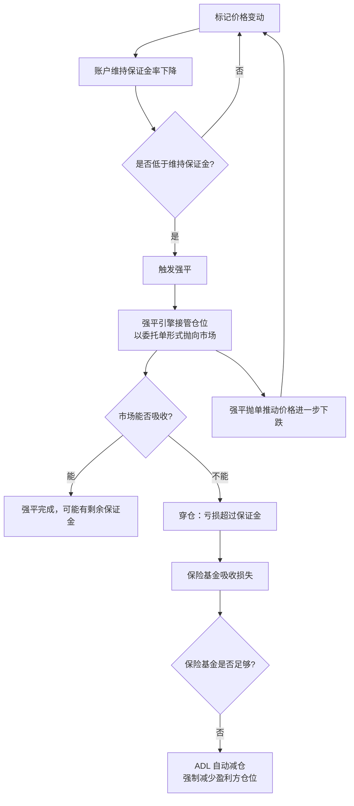

# 03 · Crypto 场内结构

> 这一章是我最该写深的地方 —— 我在 CEX 做过业务，知道这些机制在系统内部长什么样。
>
> 关键认知：**永续合约的资金费、标记价格、强平机制，本身就是可交易的结构，不只是"规则"。**

---

## 一、交易所类型与结算模型

| 类型 | 托管 | 撮合 | 结算 | 主要风险 |
|---|---|---|---|---|
| CEX（币安/OKX 等） | 交易所托管 | 中心化内存撮合 | 内部账本 | 交易对手风险（跑路/被黑/冻结） |
| 链上订单簿 DEX | 自托管或合约托管 | 链上或链下撮合链上结算 | 链上 | 合约漏洞、延迟、gas |
| AMM DEX | 合约池 | 公式定价 | 链上 | 无常损失、MEV、滑点 |
| Perp DEX（如 GMX/dYdX 类模型） | 合约 | 链下撮合/预言机定价 | 链上 | 预言机操纵、流动性池风险 |

**风控第一条：CEX 的交易对手风险大于市场风险。** 历史上多家交易所倒闭，用户资金归零。策略再好也扛不住这个。

对策：
- 资金分散到 ≥ 3 家交易所，单家占比设上限
- 只留必要的交易资金在交易所，其余转出到自托管
- 定期做提币演练（真的提一笔，验证通道畅通）
- 关注交易所的储备证明、保险基金规模、社交舆情

---

## 二、永续合约（perpetual swap）

crypto 独有的产品，也是最重要的交易工具。

### 为什么需要资金费

永续合约没有到期日，所以没有"到期收敛到现货"的机制。资金费（funding rate）就是替代的锚定机制：

```
资金费率 ≈ premium_index + clamp(interest_rate − premium_index, ±clamp_bound)
```

各交易所公式细节不同，但共同逻辑：

- **永续价格 > 现货 → 资金费为正 → 多头付给空头**
- **永续价格 < 现货 → 资金费为负 → 空头付给多头**

结算周期常见为每 8 小时（也有 1 小时、4 小时的），按结算时刻的持仓收付。

### 资金费是一个收益来源

这是 crypto 里最扎实的"风险溢价"之一：

| 场景 | 做法 | 收益来源 |
|---|---|---|
| 资金费长期为正（牛市常态） | 现货多 + 永续空（delta 中性） | 收资金费 |
| 资金费极端为负（恐慌时） | 现货空/借币 + 永续多 | 收资金费 |
| 跨所资金费差 | 在费率高的所做空，费率低的所做多 | 收费率差 |

**注意**：这不是无风险套利。真实风险包括：
- 交易所风险（最大的一个）
- 强平风险（两条腿的保证金管理不当会被单边强平）
- 资金费突然反向（拥挤交易反转时）
- 基差扩大导致浮亏触发保证金要求
- 提币/划转延迟导致无法及时补保证金

### 资金费的实证特征（值得自己验证）

- 长期均值通常为正（多头付费为常态，因为散户偏好做多加杠杆）
- 与市场情绪高度相关，极端行情时可以达到很高的年化水平
- 有明显的均值回归倾向
- 高资金费往往伴随高 OI → 是"拥挤度"的度量 → 也是**清算级联的前兆**

**这三条给出了两类策略**：直接的 carry（收费率），和把资金费当作情绪/拥挤度因子（预测反转）。

---

## 三、标记价格（mark price）

### 为什么不用最新成交价

如果用最新成交价计算未实现盈亏和强平，那么攻击者可以用小额资金在薄盘上瞬间打出一根插针，触发大量强平然后获利。这叫**强平猎杀**。

所以交易所用标记价格：

```
标记价格 ≈ 指数价格（多家现货交易所加权中位数）+ 平滑后的基差
```

关键特性：
- **指数价格来自多个外部现货交易所**，单一交易所被操纵不影响
- 用中位数/剔除极值，抗操纵
- 基差部分做移动平均平滑，避免瞬时跳变

### 实务含义

| 含义 | 说明 |
|---|---|
| 强平用标记价格，不是成交价 | 你看到"最低价打到了我的强平价"但没被强平，是因为标记价没到 |
| 未实现盈亏用标记价格 | 所以你的浮亏和"最新价"算出来的不一样 |
| 标记价与成交价的偏离本身是信号 | 大幅偏离说明该所出现局部异常 |
| 跨所策略必须知道每个所的指数构成 | 指数成分不同 → 标记价不同 → 强平点不同 |

---

## 四、强平机制与连环强平

### 完整流程



### 连环强平（liquidation cascade）

关键在图里的 `L → A` 这条反馈回路：

1. 价格下跌触发一批多头强平
2. 强平引擎在市场上抛售 → 价格进一步下跌
3. 触发下一批更高杠杆位置的强平
4. 循环放大，直到强平队列出清或有大买盘接手

结果是**短时间内的极端价格波动 + 快速反弹**（因为强平抛压是非信息性的、一次性的）。

### 怎么从数据识别正在发生的强平

| 信号 | 特征 |
|---|---|
| 交易所强平数据流 | 部分交易所直接推送强平订单（WS `forceOrder` 类频道）—— **最直接** |
| OI 骤降 | 未平仓量急剧下降 = 大量仓位被平掉 |
| 单向连续大额成交 | 逐笔数据里同方向连续吃单 |
| 价格跳变 + 深度瞬间抽空 | 订单簿被吃穿 |
| 资金费瞬时极值 | 结构性失衡 |
| 标记价与成交价大幅偏离 | 局部踩踏 |

### 这里的交易机会

**这是 crypto 里最典型的"行为偏差 + 结构性"机会**：

- 强平抛压是**被迫的、非信息性的**，所以价格偏离是暂时的
- 强平结束后往往有快速均值回归
- 事前：高 OI + 高资金费 + 拥挤方向一致 = 级联风险高，可以提前减仓或反向布局
- 事中：在极端偏离处挂限价单接盘（但要控制仓位，因为你在赌"这就是底"）

**警告**：这类策略的收益分布是"多次小赚 + 偶尔巨亏"。如果你在真正的趋势性崩盘（不只是级联）里接盘，会亏光。必须有硬止损和仓位上限。

---

## 五、保证金模式与账户结构

| 模式 | 说明 | 适用 |
|---|---|---|
| 逐仓（isolated） | 每个仓位独立保证金，爆仓只损失该仓位 | 高风险单一押注、风险隔离 |
| 全仓（cross） | 账户所有余额共同做保证金 | 对冲组合、多腿策略。**delta 中性套利必须用全仓**，否则单腿会被误强平 |
| 统一账户 / 组合保证金 | 现货、合约、期权共享保证金，风险对冲后计算 | 资金效率最高，是做多策略组合的首选 |

### 关键概念

| 概念 | 说明 |
|---|---|
| 初始保证金 | 开仓需要的保证金 |
| 维持保证金 | 不被强平的最低保证金，通常随仓位大小**阶梯上升** |
| 阶梯保证金 | 仓位越大，允许杠杆越低。**大仓位的真实可用杠杆远低于标称最大杠杆** |
| 保险基金 | 吸收穿仓损失，规模变化是市场压力指标 |
| ADL | 保险基金不足时强制减少盈利方仓位。**你可能因为赚钱而被强制平仓** |

ADL 这一条经常被忽略：极端行情下，你的盈利对冲腿可能被交易所强制平掉，导致对冲失效、裸露风险。设计对冲策略必须考虑这个尾部情景。

---

## 六、跨交易所差异（做多所策略必查）

每次接入新交易所，必须核对这张表：

| 项目 | 为什么重要 |
|---|---|
| 费率结构（含 VIP 档、maker 是否负费率） | 决定策略可行性 |
| 资金费结算周期与公式、上下限 | 决定 carry 收益计算 |
| 标记价格的指数成分 | 决定强平点 |
| 阶梯保证金表 | 决定实际可用杠杆 |
| 最小下单量 / 价格精度 / 数量精度 | 下单被拒的常见原因 |
| API 限流规则（权重制） | 决定架构设计 |
| WS 订单簿维护方式与序列号语义 | 决定本地簿实现 |
| 订单类型支持与语义差异 | post-only、reduce-only 是否支持 |
| 是否支持统一账户 | 决定资金效率 |
| 划转/提币规则与到账时间 | 决定跨所套利的风险窗口 |
| 历史数据可得性 | 决定能不能回测 |
| 强平数据是否公开推送 | 决定能不能做级联策略 |

**工程建议**：建一个 `venue_spec.yaml` 配置，把每个所的这些参数结构化，策略层从配置读取而不是硬编码。这是我做后端多渠道接入的老套路，在这里同样适用。

---

## 七、动手清单

- [ ] 建立 `venue_spec.yaml`，填完至少 3 家交易所的上表所有字段
- [ ] 拉 1 年以上资金费历史，统计分布、均值、极值、自相关，算年化 carry
- [ ] 验证资金费与 OI、价格动量的关系
- [ ] 订阅强平数据流，采集并统计强平事件的规模分布与时间聚集性
- [ ] 复现一次历史级联事件（找一个大跌日），从逐笔+OI+资金费数据还原过程
- [ ] 计算一个 delta 中性 carry 仓位的完整成本与收益（含双边手续费、资金费、划转成本）
- [ ] 手算一个仓位在阶梯保证金下的真实强平价，与交易所显示的对比

---

## 参考

- 各交易所文档的这几节：合约细则、资金费率、标记价格、强平流程、阶梯保证金、API 限流 —— **这是本章的主要"教材"**
- 交易所的历史强平数据与保险基金余额页面
- Crypto 研究机构的市场结构报告（关注 OI、资金费、清算数据的解读方法）
- [`02-strategy-zoo/04-arbitrage-basis-funding.md`](../02-strategy-zoo/04-arbitrage-basis-funding.md)：把这些机制变成策略
