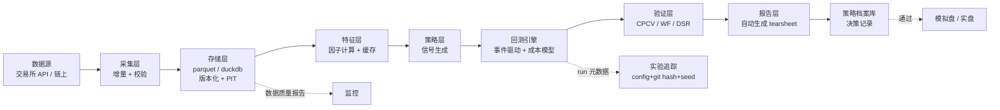

# 03 · 研究基础设施

> **这一章是整个仓库的核心，也是我最有优势的一章。**
>
> 量化的真实工作量分布：数据清洗 40%、回测与验证 30%、排查偏差 20%、想策略 10%。
> 大多数人把时间花在最后那 10% 上，然后被前面 90% 的问题害死。

---

## 一、为什么这一章最重要

策略想法是廉价的，验证能力是稀缺的。

同一个策略想法，交给两个人：
- 一个人在 Notebook 里拉数据、跑回测、看到夏普 2.5、上实盘、亏钱
- 一个人有流水线：自动检测未来函数、CPCV 验证、成本敏感性、DSR 修正 → 发现真实夏普 0.3 → 淘汰，省下时间和钱

**区别不在智商，在基础设施。**

而搭基础设施是**纯软件工程**问题。这是我 10 年后端经验能直接兑现的地方 —— 也是我相对数学背景更强的人的比较优势。

---

## 二、章节

| 文件 | 内容 | 优先级 |
|---|---|---|
| [01-data-pipeline.md](./01-data-pipeline.md) | 数据源、采集、存储、质量校验、PIT 正确性 | P0 |
| [02-backtesting-engines.md](./02-backtesting-engines.md) | 事件驱动 vs 向量化、自研 vs 框架、架构设计 | P0 |
| [03-backtest-pitfalls.md](./03-backtest-pitfalls.md) | **11 类回测偏差与检查清单** | **P0 最重要** |
| [04-factor-research-workflow.md](./04-factor-research-workflow.md) | 因子定义、IC/IR、分层回测、正交化 | P0 |
| [05-evaluation-metrics.md](./05-evaluation-metrics.md) | 指标体系、CPCV、Walk-forward、DSR、PBO | P0 |

**如果只能读一篇，读 [`03-backtest-pitfalls.md`](./03-backtest-pitfalls.md)。**

---

## 三、目标架构



### 出口标准

**一个新因子想法，从代码到完整评估报告，30 分钟内完成。**

达到这个标准，你的研究吞吐量会比手工模式高一个数量级。而在一个"绝大多数想法都是无效的"领域里，**吞吐量就是竞争力**。

---

## 四、设计原则

1. **数据不可变，只追加**。永不覆盖历史数据。修正就写新版本，保留旧版本。
2. **一切可复现**。给一个 run_id，能完整重建当时的结果（数据版本 + 代码 commit + 配置 + 种子）。
3. **回测引擎物理上无法看到未来**。用事件循环强制，不靠人的自觉。
4. **成本模型是一等公民**，不是事后加的参数。
5. **验证比回测重要**。回测告诉你"过去会怎样"，验证告诉你"这个结论可信吗"。
6. **失败的实验也要记录**。这是 DSR 修正的输入，也防止重复踩坑。
7. **报告自动化**。手工做图表 = 你会偷懒 = 你会漏掉关键检查。

---

## 五、必须记录的实验元数据

```yaml
run_id: uuid
timestamp: 2026-09-06T12:00:00Z
git_commit: abc123
git_dirty: false          # true 则结果不可信
data_manifest_hash: def456
data_range: [2023-01-01, 2026-08-31]
universe: [...]
config: {...}
random_seed: 42
lib_versions: {...}

# 用于多重检验修正
trials_this_session: 47
cumulative_trials_this_strategy: 312
```

最后两行是最容易被忽略、也最重要的。**没有试验次数记录，你无法知道自己的"发现"里有多少是运气。**

---

## 六、动手路线

| 阶段 | 做什么 | 对应 lab |
|---|---|---|
| 1 | 数据管道：采集 + 存储 + 质量校验 | `lab-01-data-collector` |
| 2 | 手写事件驱动回测器（含成本模型） | `lab-02-first-backtest` |
| 3 | 因子研究流水线 + 自动报告 | `lab-03-factor-lab` |
| 4 | 加验证层（CPCV / WF / DSR） | `lab-03` 扩展 |

**不要跳过手写回测器这一步。** 直接用现成框架，你永远不会真正理解"回测为什么会骗你"。

---

## 七、参考

- López de Prado, *Advances in Financial Machine Learning*（**本章的方法论主要来源**，Ch.3、7、11、12 必读）
- Bailey, Borwein, López de Prado & Zhu, "Pseudo-Mathematics and Financial Charlatanism"（回测过拟合的经典论文）
- `nautilus_trader` 源码（生产级架构参考）
- `qlib` 的因子研究工作流设计
- [`00-foundations/04-python-data-stack.md`](../00-foundations/04-python-data-stack.md)：工程规范
