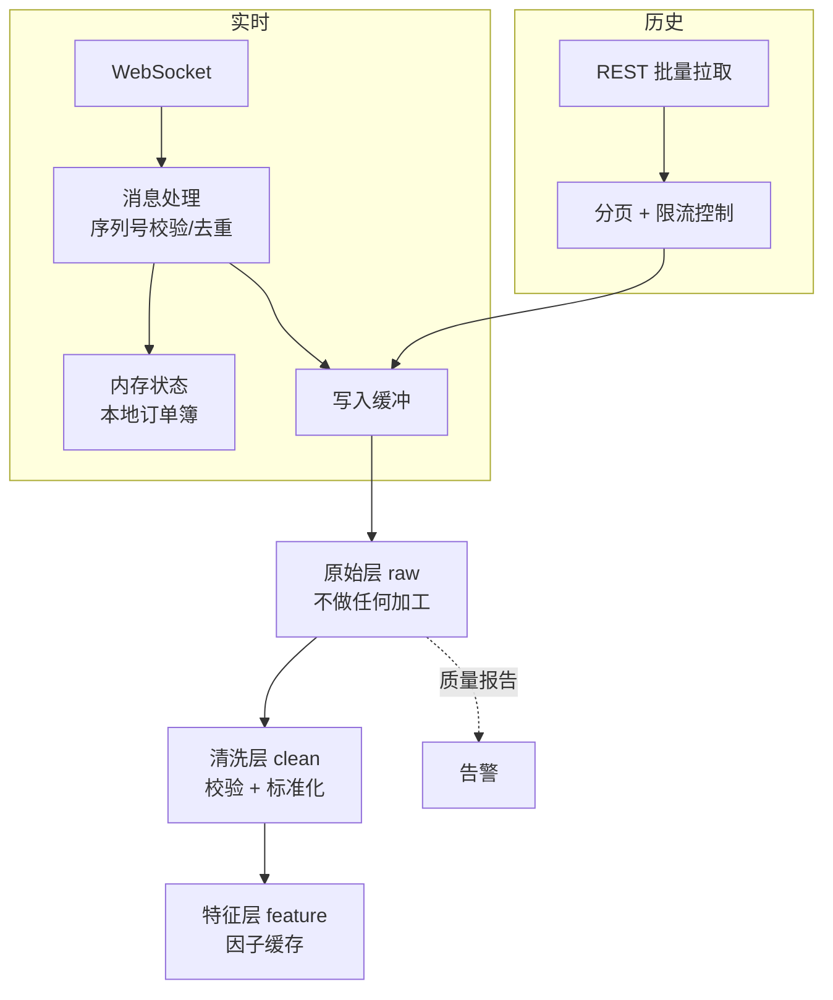

# 01 · 数据管道

> 数据质量决定研究上限。**脏数据上跑出来的漂亮回测，是最贵的一种自欺。**
>
> 好消息：crypto 数据免费且完整。坏消息：免费的数据没人帮你保证质量。

---

## 一、数据类型与用途

| 类型 | 粒度 | 体积 | 用途 | 优先级 |
|---|---|---|---|---|
| K 线（OHLCV） | 1m / 1h / 1d | 小 | 低中频策略、因子研究 | P0 |
| 逐笔成交（trades） | 每笔 | 大 | 微观结构、成交方向、级联识别 | P1 |
| L2 深度快照 | 秒级/事件级 | **极大** | 滑点建模、做市、OFI | P1 |
| 资金费率 | 每结算周期 | 小 | carry 策略、情绪因子 | **P0** |
| 未平仓量 (OI) | 分钟级 | 小 | 拥挤度、四象限 | **P0** |
| 标记价 / 指数价 | 秒级 | 中 | 强平模拟、跨所对比 | P1 |
| 强平数据 | 事件 | 小 | 级联策略 | P1 |
| 多空持仓比 | 分钟级 | 小 | 情绪因子 | P2 |
| 合约规格 | 静态（会变） | 小 | 精度、最小下单量、阶梯保证金 | **P0** |
| 上下币公告 | 事件 | 小 | 幸存者偏差处理、事件策略 | **P0** |
| 期权链与 IV | 分钟级 | 中 | 波动率策略、IV 因子 | P2 |
| 链上数据 | 区块级 | 极大 | 替代数据因子 | P2 |
| 新闻/社媒 | 事件 | 中 | NLP 情绪因子 | P3 |

### 起手最小集（先拿到这些就能开工）

1. 日线 + 小时线 OHLCV，20+ 标的，2 年以上
2. 资金费率历史
3. OI 历史
4. 合约规格（精度、最小量、费率）
5. **上下币时间表**（做幸存者偏差处理必需）

第 5 条最容易被忽略但极其重要 —— 没有它，你的标的池天然有幸存者偏差。

---

## 二、采集架构



### 三层存储设计（关键）

| 层 | 内容 | 规则 |
|---|---|---|
| **raw** | 原始 API 响应，一字不改 | **只追加，永不修改**。带采集时间戳。出问题能回溯 |
| **clean** | 标准化后的数据 | 统一 schema、UTC 时间、统一精度、标记异常 |
| **feature** | 计算好的因子 | 可重算，可删除，用于加速 |

**raw 层的价值**：当你发现清洗逻辑有 bug 时，能从原始数据重建。没有 raw 层，你只能重新下载（可能已经拿不到了）。

这是数据工程的标准做法（ELT 而非 ETL），我在后端做数据链路时的经验直接适用。

### 存储选型

| 方案 | 适用 |
|---|---|
| parquet 按 `symbol/year/month` 分区 | K 线、资金费、OI —— **默认选择** |
| duckdb | 直接对 parquet 跑 SQL，本地分析主力 |
| clickhouse / timescaledb | 逐笔和深度数据量大时 |
| 单文件 parquet | 静态元数据（合约规格、上下币表） |

分区策略要考虑查询模式：按标的+时间分区，能让"只读某个币某段时间"的查询只扫描必要文件。

---

## 三、数据质量校验（必须自动化）

每次采集后自动跑，生成质量报告：

| 检查 | 方法 | 严重性 |
|---|---|---|
| **时间连续性** | 按周期生成完整时间轴，找缺失的 bar | 高 |
| 重复记录 | 按 (symbol, timestamp) 去重，统计重复数 | 高 |
| OHLC 逻辑 | `low ≤ min(open,close) ≤ max(open,close) ≤ high` | 高 |
| 零/负值 | 价格 ≤ 0、成交量 < 0 | 高 |
| 极端跳变 | 单周期变动 > N 倍标准差，人工确认是真行情还是脏数据 | 中 |
| 成交量异常 | 长期为 0（可能已停止交易）或突增几个数量级 | 中 |
| 时间戳时区 | 必须全部 UTC，且带 tz 信息 | 高 |
| 精度一致性 | 价格/数量的小数位符合合约规格 | 中 |
| 跨源交叉验证 | 同一标的从两个源拉取，对比差异 | 中 |
| 资金费完整性 | 按结算周期检查是否每期都有 | 高 |

### 关键：区分"缺失"和"零"

`volume = 0` 可能意味着：真的没成交、数据缺失、交易暂停。三者对回测的影响完全不同。**必须用不同的标记区分，不能都填 0。**

### 处理原则

| 情况 | 处理 |
|---|---|
| 少量缺失（< 1%，孤立） | `ffill` 但**打标记**，回测时可选择跳过这些 bar |
| 大段缺失 | 不填充，标记为不可交易区间 |
| 明显脏数据（插针到 0） | 修正并记录修正日志，同时保留 raw |
| 交易暂停期 | 明确标记，回测中不允许交易 |
| 不确定 | **保守：标记为不可用，宁可少数据也不要假数据** |

**永远不要静默填充。** 每个填充动作都要留痕，因为它可能就是你回测虚高的来源。

---

## 四、Point-in-Time 正确性（最隐蔽的陷阱）

### 什么是 PIT 问题

你今天下载的历史数据，和当时真实可见的数据不一样。

| 场景 | 问题 |
|---|---|
| 交易所修正历史 K 线 | 你现在看到的是修正后的，当时看到的是错的 |
| 标的池用今天的列表 | 幸存者偏差 |
| **链上地址标签** | 今天知道某地址是交易所，2 年前不知道 |
| 代币的市值/流通量数据被回溯修订 | 当时的流通量数据可能不同 |
| 指数成分回溯调整 | |
| 项目分类/板块标签 | 今天的分类是基于今天的认知 |

### 解决方案

1. **数据带两个时间戳**：`event_time`（事件发生时间）和 `ingest_time`（采集时间）
2. **查询时可指定"截至某个 ingest_time 的视图"** —— 这样回测就只能看到当时可得的数据
3. **元数据版本化**：标的池、标签、分类都保存快照，不覆盖
4. **只用不需要标注的指标**（如果做不到 PIT，就避开需要标注的因子）

```python
# PIT 查询的概念
def get_data_as_of(symbol, event_range, as_of_time):
    """只返回在 as_of_time 之前采集到的数据"""
    return raw.filter(
        (symbol == symbol) &
        (event_time.between(*event_range)) &
        (ingest_time <= as_of_time)      # ← 关键这一行
    )
```

**成本**：实现 PIT 有额外工程成本。**收益**：避免一整类隐蔽的未来函数。对我来说，这是值得先投入的 —— 因为这正是工程能力的用处。

---

## 五、幸存者偏差的具体处理

crypto 里这个问题比股票更严重（币的死亡率极高）。

### 必须做的

1. **维护完整的标的历史表**：`symbol, listing_date, delisting_date, status, delisting_reason`
2. **回测时的标的池按时间点动态确定**：在时刻 t，只包含当时已上市且未下架的标的
3. **下架标的的最终价格处理**：下架不等于归零，要区分"因流动性下架"和"项目归零"
4. **对比实验**：跑一遍"只用现存标的" vs "含已下架标的"，量化偏差幅度

### 偏差量级

这个差异通常很大，尤其是截面策略。做一次对比实验，你会明白为什么很多"选币策略"在实盘上不 work。

---

## 六、增量更新与容错

生产级采集器必须处理的：

| 问题 | 做法 |
|---|---|
| 断点续传 | 记录每个 (symbol, interval) 的最后成功时间戳 |
| 限流 | 令牌桶 + 指数退避重试；用 WS 替代高频 REST 轮询 |
| 部分失败 | 单个标的失败不影响其他，记录失败列表并重试 |
| 重复运行 | 幂等：重跑不会产生重复数据 |
| WS 断线 | 自动重连 + 重新订阅 + 从 REST 补齐断线期间的数据 |
| 序列号断裂 | 检测到就重新拉 snapshot 并重建 |
| 时钟漂移 | 记录本地时间与交易所时间的偏差 |
| 交易所 API 变更 | schema 校验，变更时告警而不是静默出错 |

**这一整套就是我做后端数据链路的日常。** 直接把工程经验搬过来即可，不需要重新学。

---

## 七、动手清单

- [ ] 设计三层存储（raw / clean / feature），确定分区方案
- [ ] 实现历史 K 线批量拉取（含分页、限流、断点续传、幂等）
- [ ] 实现资金费率、OI、合约规格的采集
- [ ] 建立标的历史表（含上下架时间），从公告数据提取
- [ ] 实现全套数据质量校验，输出质量报告
- [ ] 实现 `event_time` + `ingest_time` 双时间戳与 PIT 查询接口
- [ ] 实现 WS 实时采集（含断线重连、序列号校验、REST 补齐）
- [ ] 跨源交叉验证：同一标的从两个交易所拉，对比差异
- [ ] 做幸存者偏差对比实验，量化影响
- [ ] 生成 data manifest（数据清单 + 哈希），供 run 元数据引用

---

## 参考

- 各交易所 API 文档（**主要教材**：限流规则、历史数据端点、WS 订阅协议）
- López de Prado, *AFML*, Ch.2（数据结构：tick bar、volume bar、dollar bar、信息驱动 bar）
- `duckdb` 文档（parquet 直查、分区裁剪）
- `ccxt` 源码（多交易所差异的处理方式）
- [`00-foundations/04-python-data-stack.md`](../00-foundations/04-python-data-stack.md)
