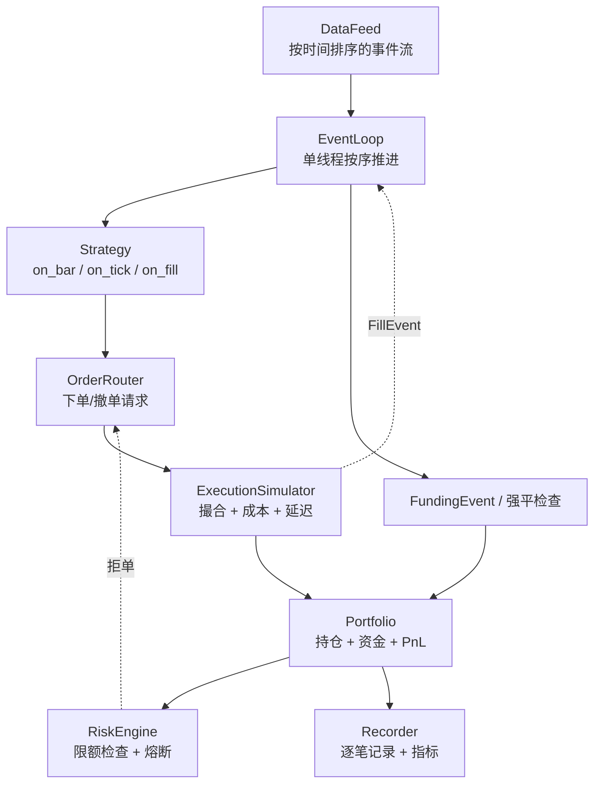

# 02 · 回测引擎

> 回测器的设计目标不是"跑得快"，而是**"物理上不可能看到未来"**。
>
> 结论先说：**先手写一个事件驱动回测器**（`lab-02`），再用 `nautilus_trader` 做严肃研究。跳过第一步的人永远不理解回测为什么会骗人。

---

## 一、两种范式

### 向量化（vectorized）

```python
signal = compute_signal(df)              # 一次算出所有信号
pnl = signal.shift(1) * df['return']     # 一次算出所有收益
```

| 优点 | 缺点 |
|---|---|
| 极快（`vectorbt` 可以秒级跑几万组参数） | **容易引入未来函数**（`shift` 写错就完了） |
| 代码简洁 | 难以建模路径依赖（止损、库存、部分成交） |
| 适合大规模参数粗筛 | 难以模拟真实执行（队列、延迟、拒单） |
| | 难以处理多资产的资金约束 |

### 事件驱动（event-driven）

```python
for event in event_stream:              # 严格按时间顺序
    match event.type:
        case "BAR" | "TICK":
            strategy.on_data(event)      # 只能看到当前及历史
        case "ORDER_FILL":
            portfolio.on_fill(event)
        case "FUNDING":
            portfolio.on_funding(event)
```

| 优点 | 缺点 |
|---|---|
| **结构上防未来函数**（只能拿到已推送的事件） | 慢（Python 里可能慢 100 倍） |
| 能模拟真实执行（延迟、队列、部分成交、拒单） | 代码复杂 |
| 路径依赖天然支持（止损、库存管理） | |
| **回测与实盘可共用策略代码** ← 最大价值 | |

### 我的选择

| 场景 | 用什么 |
|---|---|
| 粗筛大量参数/想法 | 向量化（`vectorbt` 或自己写 numpy） |
| 严肃验证、准备上实盘 | 事件驱动 |
| 做市/高频 | 事件驱动 + 订单簿模拟（必须） |
| 实盘 | 事件驱动（与回测同一套策略代码） |

**"回测与实盘共用同一份策略代码"是事件驱动最重要的价值。** 两套代码必然会不一致，不一致就意味着你的回测在验证一个不存在的东西。这是 `nautilus_trader` 的核心设计理念，也是我选它的原因。

---

## 二、事件驱动回测器的架构



### 各组件职责

| 组件 | 职责 | 关键设计点 |
|---|---|---|
| **DataFeed** | 产出按时间严格排序的事件 | 多标的多数据源需要**归并排序**；同时间戳的事件顺序要确定（否则结果不可复现） |
| **EventLoop** | 单线程按时间推进 | **绝不允许策略访问未来事件**。这是防未来函数的物理保证 |
| **Strategy** | 接收数据，产生订单意图 | 只能通过回调拿数据，不能直接查询 DataFrame |
| **OrderRouter** | 订单的生命周期管理 | 状态机：new → submitted → partial → filled/canceled/rejected |
| **ExecutionSimulator** | 模拟撮合 | 成本模型、延迟、部分成交、拒单、队列位置 |
| **Portfolio** | 持仓、资金、盈亏 | 精度用整数最小单位；未实现/已实现盈亏分离 |
| **RiskEngine** | 独立的风控检查 | **必须独立于策略**，策略不能绕过 |
| **Recorder** | 记录一切 | 每笔订单、每次成交、每个时点的持仓与净值 |

### Crypto 特有的必需组件

| 组件 | 为什么必须 |
|---|---|
| **资金费结算事件** | 永续持仓必须按周期收付资金费。不建模 = 回测虚高 |
| **强平检查** | 每个 bar 检查保证金率，触发则强制平仓。不建模 = 忽略最大的尾部风险 |
| **保证金计算** | 阶梯保证金、全仓/逐仓的差异 |
| **标记价格** | 强平和未实现盈亏用标记价，不是成交价 |
| **合约精度与最小下单量** | 否则回测的仓位在实盘下不出去 |
| **交易暂停/下架处理** | 标的不可交易时的强制退出 |

**如果你的 crypto 回测没有资金费和强平，它的结果是无意义的。** 这两个是我见过最常被忽略、影响最大的两项。

---

## 三、关键设计决策

### 1. 成交时点：bar 内还是 bar 后

| 方案 | 说明 | 风险 |
|---|---|---|
| 用当前 bar 的收盘价成交 | 信号在收盘时产生，同时成交 | **未来函数**：你在收盘时才知道收盘价 |
| 用下一个 bar 的开盘价成交 | 保守且真实 | **推荐** |
| 用下一个 bar 的 VWAP | 更接近真实执行 | 需要 bar 内数据 |
| 用信号后 N 秒的实际价格 | 最真实 | 需要 tick 数据 |

**默认规则：信号在 bar t 生成，成交在 bar t+1 的开盘。** 这是最基本的安全边界。

### 2. 同时间戳事件的顺序

如果两个事件时间戳相同，处理顺序会影响结果。必须**明确定义优先级**并固定：

```
优先级：资金费结算 > 强平检查 > 行情更新 > 订单成交回报 > 策略回调
```

不固定顺序 = 结果不可复现。

### 3. 延迟建模

| 层级 | 说明 |
|---|---|
| 无延迟 | 只适合日线以上 |
| 固定延迟 | 简单，比无延迟好得多 |
| **延迟分布采样** | 用实测的延迟分布，包含长尾 —— **中高频必须** |

延迟建模的关键是**长尾**：99% 的时候 20ms，1% 的时候 2 秒。那 1% 决定了你的尾部损失。用固定均值会完全掩盖这个风险。

### 4. 部分成交与拒单

真实市场里部分成交是常态。回测必须支持：
- 限价单只成交一部分
- 剩余部分继续挂着或超时撤销
- 订单被拒（精度错误、保证金不足、限流）

**不建模部分成交的回测，会系统性高估限价单策略的表现。**

### 5. 资金约束

多标的策略必须建模资金约束：
- 总资金有限，不能同时全仓所有标的
- 保证金占用
- 现货和合约的资金隔离（或统一账户的共享）

忽略资金约束 = 回测里你有无限资金 = 收益虚高。

---

## 四、性能优化（在正确之后）

| 手段 | 提速 |
|---|---|
| 用 numpy 数组而非 pandas 逐行访问 | 10-100x |
| `numba` JIT 编译事件循环热路径 | 10-50x |
| 预计算所有因子（而非循环内计算） | 大 |
| 事件对象用 slots / 结构体而非 dict | 2-5x |
| 参数扫描并行化（`joblib`） | 核数倍 |
| 先小样本验证逻辑，再全量 | 开发效率 |
| 缓存特征层，避免重复计算 | 大 |

**顺序：先正确，再快。** 优化一个有 bug 的回测器毫无意义。

---

## 五、框架对比（2026 年）

| 框架 | 范式 | 优势 | 何时用 |
|---|---|---|---|
| **自研** | 事件驱动 | 完全理解、完全可控 | **第一步必做**（`lab-02`） |
| **nautilus_trader** | 事件驱动 | Rust 内核性能好、研究到实盘同代码、支持 crypto 永续 | **严肃研究与实盘的主力** |
| vectorbt | 向量化 | 极快的参数扫描 | 粗筛想法 |
| qlib | 因子研究平台 | 完整的因子工作流设计 | 学工作流设计，代码参考 |
| backtesting.py | 简单向量化 | 5 分钟上手 | 教学，不用于严肃研究 |
| backtrader | 事件驱动 | 生态成熟 | 参考其架构设计 |
| hummingbot | 实盘机器人 | 生产级 crypto 做市实现 | 读源码学工程 |

### 为什么推荐 nautilus_trader

1. **研究-实盘一致性**：同一份策略代码，换个 adapter 就上实盘。这消除了整整一类 bug。
2. 原生支持 crypto 永续、资金费、保证金
3. Rust 内核，事件驱动也能跑得快
4. 架构设计值得学（我会读它的源码）

**但仍然要先自己写一个。** 理解了原理之后再用框架，你会知道每个配置项在防什么坑。

---

## 六、回测器的自测（必做）

写完回测器，用这些测试验证它没骗你：

| 测试 | 方法 | 期望 |
|---|---|---|
| **零信号测试** | 策略永不下单 | PnL 严格等于 0 |
| **买入持有测试** | 策略第一天买入并持有 | PnL 等于标的收益（减去一次手续费） |
| **未来函数测试** | 在未来某点插入巨大异常值 | 该点之前的 PnL 不应有任何变化 |
| **成本零化测试** | 手续费和滑点设为 0 | PnL 应等于"理想 PnL" |
| **确定性测试** | 同一配置跑两遍 | 结果完全一致（bit-level） |
| **精度测试** | 跑 10 万笔交易 | 最终资金与逐笔累加一致，无浮点漂移 |
| **强平测试** | 构造极端行情 | 强平被正确触发，损失符合预期 |
| **资金费测试** | 已知资金费率与持仓 | 手算与回测结果一致 |

**"未来函数测试"是最有价值的一个。** 它能自动发现绝大多数信息泄漏。

---

## 七、动手清单

- [ ] 手写事件驱动回测器：DataFeed / EventLoop / Strategy / ExecutionSimulator / Portfolio / Recorder
- [ ] 实现多标的数据源的归并排序，固定同时间戳事件优先级
- [ ] 实现分级成本模型（L1 → L3），可配置切换
- [ ] 实现资金费结算事件与强平检查
- [ ] 实现订单状态机（含部分成交、拒单、超时撤销）
- [ ] 实现资金与保证金约束
- [ ] 写全套自测（上表 8 项），全部通过
- [ ] 用 numba 优化事件循环，测量提速
- [ ] 实现 run 元数据记录与确定性验证
- [ ] 跑通 `nautilus_trader` 的示例，对比自己实现的差异，记录学到的东西

---

## 参考

- `nautilus_trader` 文档与源码（**主要学习对象**）
- López de Prado, *AFML*, Ch.11-13（回测的方法论与危险）
- `backtrader` / `zipline` 的架构文档（事件驱动设计的经典实现）
- [`01-market-microstructure/02-execution-costs-and-slippage.md`](../01-market-microstructure/02-execution-costs-and-slippage.md)：成本模型细节
- [`03-backtest-pitfalls.md`](./03-backtest-pitfalls.md)：回测器要防的所有坑
