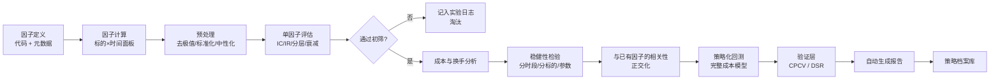

# 04 · 因子研究流水线

> 目标：**把"研究一个因子"从手工活变成流水线作业。** 一个新想法 30 分钟内出完整评估报告。
>
> 这是研究吞吐量的核心。在一个"绝大多数想法都无效"的领域，吞吐量就是竞争力。

---

## 一、流水线全貌



---

## 二、因子定义与元数据

每个因子必须有结构化定义，不只是一段代码：

```yaml
factor_id: funding_zscore_7d
name: 资金费率 7 日 z-score
category: 情绪/拥挤度
data_requirements: [funding_rate]
lookback: 7d
frequency: 8h
hypothesis: |
  资金费率极端为正 = 多头拥挤 = 短期反转风险上升。
  预期符号：负（高 z-score 对应低未来收益）
expected_sign: -1
economic_rationale: 行为偏差 + 拥挤度
known_issues: |
  与价格动量高度相关，需要正交化。
  在低波动期噪声大。
author: frank
created: 2026-09-06
```

`hypothesis` 和 `expected_sign` 是关键：**先写下预期，再看结果。** 如果结果符号与预期相反，那不是"发现了反向 alpha"，而是你的理解有问题，需要重新想清楚 —— 否则就是在做曲线拟合。

---

## 三、预处理（顺序很重要）

```
原始因子值
  → 1. 缺失值处理（标记而非填充）
  → 2. 去极值（winsorize / MAD 截断）
  → 3. 标准化（截面 z-score 或排序百分位）
  → 4. 中性化（beta / 板块 / 市值）
  → 5. 平滑（可选，降低换手）
```

| 步骤 | 做法 | 注意 |
|---|---|---|
| 去极值 | MAD 法（中位数绝对偏差）优于标准差法 | crypto 极端值多，必须做 |
| 标准化 | 截面 z-score 或 rank 转百分位 | **rank 更稳健**，对分布假设不敏感 |
| **中性化** | 对 BTC beta、板块、市值做回归取残差 | **crypto 里 beta 中性化是必须的** |
| 平滑 | 对因子做移动平均 | 降换手降成本，但会滞后信号 |

### 为什么 crypto 必须做 beta 中性化

crypto 第一主成分（BTC beta）解释力极强。不中性化，你测出来的"因子有效"很可能只是"高 beta 币在牛市涨更多"。

```python
# 概念示意
resid = factor_value - β_hat * btc_factor_exposure
# 或者对未来收益做中性化：
excess_return = asset_return - β_hat * btc_return
```

**做与不做，IC 可能差一倍以上。** 这是我要在 lab-03 里亲自验证的一件事。

### 关键纪律：一切用滚动窗口

去极值的阈值、标准化的均值方差、中性化的 beta —— **全部必须用截止当前的滚动窗口估计**。用全样本 = 未来函数。

---

## 四、单因子评估指标

### IC（信息系数）

```
IC_t = corr(factor_t, return_{t+1})           # 截面相关性
Rank IC_t = spearman(factor_t, return_{t+1})  # 更稳健，推荐
```

| 指标 | 定义 | 参考感觉 |
|---|---|---|
| IC 均值 | 平均预测能力 | 0.02-0.05 就算不错；> 0.1 要怀疑有 bug |
| IC 标准差 | 稳定性 | |
| **IR = IC均值 / IC标准差** | 风险调整后的预测能力 | **核心指标**，> 0.3 有价值 |
| IC 胜率 | IC > 0 的期数比例 | > 55% 不错 |
| IC t 值 | 显著性 | 但注意多重检验 |
| IC 衰减曲线 | IC 随预测周期（1期、2期…N期）的变化 | **决定最优持仓周期** |
| IC 自相关 | IC 序列本身是否稳定 | |

### IC 衰减曲线的用途

画出"预测周期 → IC"曲线：
- 峰值在第 1 期 → 短周期因子，换手高，成本敏感
- 峰值在第 5-10 期 → 中周期，成本压力小
- 快速衰减到 0 → 信号时效短，执行要求高
- 缓慢衰减 → 信号持久，可以低换手

**这条曲线直接告诉你调仓频率应该是多少。** 比参数扫描找最优持仓周期更可靠（后者容易过拟合）。

### 分层回测（quantile backtest）

```
1. 每期按因子值把标的分成 N 组（常用 5 或 10）
2. 计算每组的下期收益
3. 看是否单调（Q1 < Q2 < ... < Q5）
4. 多空组合收益 = Q_top − Q_bottom
```

| 观察 | 含义 |
|---|---|
| 单调性好 | 因子有真实的排序能力 |
| 只有极端组有效 | 因子只在尾部有信息，容量小 |
| 非单调 | 可能是非线性关系，或者是噪声 |
| 多空收益 >> 纯多收益 | 空头贡献大，但 crypto 做空受限，要检查可行性 |

### 换手与成本

```
换手率 = 每期因子暴露变化的绝对值之和
预期成本 = 换手率 × 单边成本 × 2
净 IC 收益 = 毛收益 − 预期成本
```

**必须报告净值。** 一个 IC 0.05 但每期换手 200% 的因子，在 crypto 成本下大概是负期望。

---

## 五、稳健性检验（缺一不可）

| 检验 | 做法 | 通过标准 |
|---|---|---|
| 分时段 | 按年/按市场状态（牛/熊/震荡）分别评估 | 各时段方向一致 |
| 分标的组 | 大市值 / 中 / 小市值分组 | 不只在小市值有效（小市值往往是流动性幻觉） |
| 参数敏感性 | lookback 从 5 到 50 变化 | 参数平原而非尖峰 |
| 剔除极端期 | 去掉表现最好的 5% 时段 | 仍然正 |
| 不同标的池 | 换标的池 | 结论稳定 |
| 中性化前后 | 对比 | 中性化后仍有效（否则只是 beta） |
| 与已知因子的相关性 | 相关矩阵 | 与已有因子相关性 < 0.7（否则不是新信息） |
| 成本敏感性 | 成本 0 → 2 倍 | 2 倍成本下仍正 |
| PIT 检验 | 用 PIT 数据重跑 | 结果不显著变差 |

**任何一项不通过，就在报告里明确写出来，不许"忘记"。**

---

## 六、多因子：正交化与合成

### 相关性处理

新因子的价值在于**增量信息**，不是绝对表现。

```
1. 计算新因子与已有因子池的相关矩阵
2. 如果相关性 > 0.7，做正交化（对已有因子回归取残差）
3. 评估正交化后的残差因子是否还有 IC
4. 如果残差没有 IC，这个因子没有增量价值 → 淘汰
```

### 合成方法

| 方法 | 说明 | 适用 |
|---|---|---|
| 等权 | 标准化后简单相加 | **基线，别小看** |
| IC 加权 | 按历史 IC 加权 | 需要滚动估计，注意过拟合 |
| IR 加权 | 按 IR 加权 | 比 IC 加权更稳健 |
| 回归法 | 对未来收益做多元回归 | 容易过拟合 |
| ML 模型 | 树模型/神经网络 | 见 [`04-ml-and-frontier`](../04-ml-and-frontier/) |
| 最大化组合 IR | 类似组合优化 | 需要因子协方差 |

**经验：等权合成往往打败复杂加权。** 原因和组合优化一样 —— 权重估计的误差大于优化带来的收益。先做等权基线，复杂方法必须显著打败它才值得用。

### 因子池管理

维护一个因子库，记录每个因子的：
- 元数据（定义、假设、类别）
- 历史 IC/IR
- 与其他因子的相关性
- 状态（在用 / 观察 / 已淘汰）
- 最近表现（是否在衰减）

**因子衰减监控**：定期检查在用因子的近期 IC vs 历史 IC。衰减明显的要降权或退役。

---

## 七、自动报告

每个因子跑完自动生成 markdown/html 报告，固定包含：

```
1. 因子元数据与假设
2. IC 时间序列图 + 累积 IC 曲线
3. IC 统计表（均值/标准差/IR/胜率/t值）
4. IC 衰减曲线
5. 分层回测净值曲线（N 组）
6. 多空组合净值 + 回撤曲线
7. 换手率与成本分析
8. 稳健性检验矩阵（分时段/分标的/参数）
9. 与已有因子的相关性热力图
10. 正交化后的残差 IC
11. 试验次数与 DSR
12. 结论与下一步
```

**自动化的意义**：手工做报告你会偷懒跳过检查项，而跳过的那一项往往就是问题所在。

---

## 八、动手清单

- [ ] 设计因子定义的 yaml schema + 注册机制
- [ ] 实现因子计算框架（输入数据面板，输出因子面板，支持缓存）
- [ ] 实现预处理流水线（MAD 去极值 / rank 标准化 / beta 中性化），全部滚动窗口
- [ ] 实现 IC / Rank IC / IR 计算与 IC 衰减曲线
- [ ] 实现分层回测与多空组合
- [ ] 实现换手率与成本估算
- [ ] 实现全套稳健性检验矩阵
- [ ] 实现因子相关性分析与正交化
- [ ] 实现自动报告生成（上面 12 项）
- [ ] **验证 beta 中性化的影响**：对同一因子做中性化前后对比
- [ ] 用 5 个因子跑完整流水线，验证 30 分钟目标能否达成
- [ ] 建立因子库与衰减监控

---

## 参考

- López de Prado, *AFML*, Ch.8（特征重要性）、Ch.17-19（结构断裂与微观结构特征）
- Grinold & Kahn, *Active Portfolio Management*（IC、IR、信息法则的理论来源）
- `qlib` 的因子研究工作流（**架构参考价值高**）
- `alphalens` 类工具的评估维度设计（因子分析报告的标准范式）
- Harvey, Liu & Zhu, "…and the Cross-Section of Expected Returns"（因子研究的多重检验问题）
- [`03-backtest-pitfalls.md`](./03-backtest-pitfalls.md)：因子研究同样适用全部陷阱
