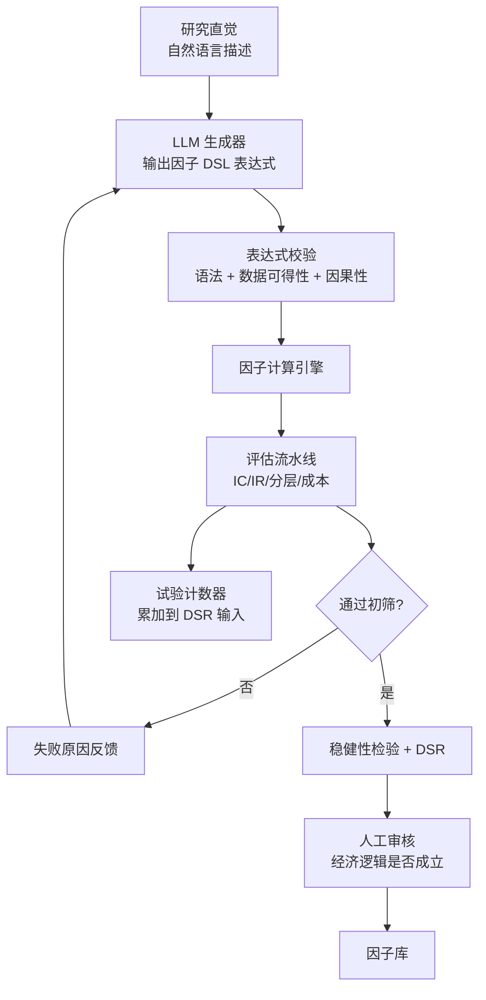

# 04 · LLM 与 Agent 在量化中的位置

> **这是我的优势区**：我有 Agent / LLM 工程落地的一线经验，而这块在量化圈里刚起步。
>
> 但必须先把边界划清楚，否则会浪费时间在错的方向上。

---

## 一、边界：LLM 该做什么、绝不该做什么

### ❌ 绝不该做

| 用法 | 为什么不行 |
|---|---|
| 问 LLM "该买还是该卖" | 多项测试显示，这类朴素用法通常打不过简单的动量/均值回归基线 |
| 让 LLM 直接管理仓位 | 不确定性无法量化，无法回测，无法风控 |
| 用 LLM 预测价格数字 | 语言模型不是数值预测器 |
| 让 LLM 决定风控参数 | 风控必须是确定性规则 |
| 相信 LLM 对市场的"判断" | 训练数据截止 + 幻觉 + 无实时信息 |

**2026 年的实际共识**：经典量化信号 + LLM 作为支撑工具，是当前的实际水平（[相关综述](https://gaper.io/can-llms-crack-algorithmic-trading-code)，内容已改写以符合许可要求）。

### ✅ 该做

| 用法 | 价值 |
|---|---|
| **文本信号提取** | 从新闻/公告/社媒中提取结构化信号 |
| **因子挖掘助手** | 把研究直觉转成候选因子表达式 |
| **研究流水线自动化** | 自动跑因子评估、生成报告、总结结论 |
| **代码生成** | 数据管道、回测脚本、报告模板 |
| **文献消化** | 快速读论文并提取可实现的方法 |
| **实验日志与知识管理** | 自动整理试验记录、避免重复踩坑 |
| **异常解释** | 实盘出现异常时，快速定位可能原因 |
| **信息聚合与摘要** | 公告、解锁日历、治理提案的结构化 |

---

## 二、LLM 辅助因子挖掘（最值得投入）

### 思路

传统因子挖掘的瓶颈是"提出假设"。研究者的直觉是自然语言的（"我觉得资金费极端时会反转"），转成可回测的表达式需要时间。

LLM 可以承接这一步：
```
研究直觉（自然语言）
  → LLM 生成候选因子表达式（多个变体）
  → 自动回测评估流水线
  → 结果反馈给 LLM
  → LLM 提出改进方向
  → 迭代
```

这类框架（Alpha-GPT 系列）在实际量化竞赛中取得了不错的成绩（[相关分析](https://systematicstandard.substack.com/p/the-alpha-gpt-revolution-how-wall)，内容已改写以符合许可要求）。

### 我的实现思路



### 关键设计：因子 DSL

不让 LLM 直接生成 Python（不安全、不可控），而是生成一个受限的领域特定语言：

```
# 示例 DSL
zscore(funding_rate, 21) * -1
rank(ts_delta(close, 5)) - rank(ts_delta(volume, 5))
neutralize(momentum(close, 20), btc_beta)
```

好处：
- 语法可校验，防止生成无法执行的代码
- **可以静态检查因果性**（禁止引用未来数据的操作）
- 可枚举可用算子和数据字段，减少幻觉
- 安全（不执行任意代码）

**这是工程能力直接创造价值的地方 —— 设计一个好的 DSL 比调 prompt 重要得多。**

### 致命风险：自动化的多重检验

LLM 一小时能生成 1000 个候选因子。如果你从中挑最好的，那就是**极端的多重检验问题**。

**必须的防护**：
1. **强制试验计数**：每个生成的候选都计入试验次数，无论是否评估
2. **DSR / PBO 修正**：按累计试验次数惩罚
3. **人工审核经济逻辑**：LLM 生成的因子必须能被解释为一个合理的经济机制。**解释不了的一律淘汰**，不管 IC 多高
4. **保留严格 holdout**：LLM 循环绝对不能接触 holdout 数据
5. **预注册假设**：先写下预期符号，结果符号相反就淘汰（不许事后改解释）

> **如果不做这些防护，LLM 因子挖掘就是"自动化的自欺欺人"**——你会以工业化的速度生产虚假发现。

---

## 三、文本信号提取

crypto 的文本数据丰富且免费：公告、治理提案、社媒、开发活动、新闻。

### 可提取的结构化信号

| 信号 | 提取方式 |
|---|---|
| 事件分类 | 上币/下架/解锁/升级/安全事件/合作 |
| 情绪极性与强度 | 分类或打分 |
| 事件重要性 | 分级 |
| 实体识别 | 涉及哪些代币、协议、机构 |
| 不确定性 | 消息的确定程度（传言 vs 官宣） |
| 新颖度 | 是新消息还是旧闻重复（**很重要**：重复报道不带新信息） |

### 关键：新颖度过滤

同一件事会被报道几十次。如果不做去重和新颖度判断，你的"情绪信号"实际上是在测量"报道量"，而报道量是滞后于价格的。

做法：用嵌入向量做相似度去重，只保留首次出现的信息。

### 工程注意

| 项 | 做法 |
|---|---|
| **时间戳精度** | 必须精确到发布时刻，不是日期。用日期 = 未来函数 |
| **PIT 正确性** | 用当时可得的文本，且模型不能是用未来数据训练的（这点很微妙：LLM 的训练数据可能包含你回测期之后的信息） |
| 成本 | 大量文本调用 LLM 成本高；用小模型或蒸馏 |
| 延迟 | 如果做事件驱动，推理延迟决定可行性 |
| 缓存 | 相同文本不重复调用 |
| 可复现 | 固定模型版本和温度；记录 prompt 版本 |

### LLM 训练数据泄漏问题（微妙但重要）

如果你用一个 2026 年训练的 LLM，去分析 2024 年的新闻并预测 2024 年的价格 —— **LLM 可能"知道"后来发生了什么**。这是一种隐蔽的未来函数。

对策：
- 用只做抽取（不做判断）的任务，减少模型"回忆"的空间
- 优先用小模型/微调模型，训练数据可控
- 在最近的、模型训练截止之后的数据上做最终验证

---

## 四、研究流水线自动化（Agent 的正确用法）

这是我最能发挥的地方 —— 不是"AI 交易员"，而是"AI 研究助理"。

| Agent 职责 | 具体任务 |
|---|---|
| 数据质量守卫 | 每日检查数据完整性，异常时生成诊断报告 |
| 因子评估执行器 | 接收因子定义，跑完整评估流水线，输出报告 |
| 实验记录员 | 自动整理试验日志、维护累计试验计数 |
| 文献消化 | 读论文，提取方法，生成"可实现步骤"清单 |
| 报告生成 | 把回测结果写成结构化的策略档案 |
| 异常诊断 | 实盘异常时，聚合日志、指标、行情，给出可能原因排序 |
| 每日复盘助手 | 汇总当日交易、成本、异常，生成复盘草稿 |

### 设计原则

1. **Agent 只做确定性可验证的工作**，不做判断性决策
2. **所有 Agent 输出必须可审计**（记录输入、prompt、输出）
3. **风控和执行链路绝不接入 LLM**（延迟不可控 + 不确定性）
4. **人在关键决策点**：策略上线、资金分配、参数调整必须人工确认
5. **Agent 的失败必须是安全失败**（fail-safe，不是 fail-open）

---

## 五、代码生成的实际用法

这是最直接的生产力提升，我已经在日常用：

| 场景 | 效果 |
|---|---|
| 数据采集脚本（各交易所 API 适配） | 很好，重复性高 |
| 回测脚本骨架 | 好，但**核心逻辑必须自己审查** |
| 报告与可视化 | 很好 |
| 单元测试生成 | 好 |
| 论文方法复现 | 中，需要仔细核对 |
| **核心成本模型 / 风控逻辑** | ⚠️ **必须自己写并逐行审查**，这里的 bug 最贵 |

**红线：任何涉及资金计算、仓位计算、风控判断的代码，必须自己写并写测试。** LLM 生成的这类代码有微妙 bug 的概率不低，而这类 bug 直接对应真金白银。

---

## 六、我的落地路线

| 阶段 | 做什么 |
|---|---|
| 现在 | 用 LLM 加速数据管道、报告生成、文献消化 |
| 阶段二 | 建因子 DSL + 自动评估流水线（不含 LLM 生成，先把评估自动化） |
| 阶段三 | 接入 LLM 因子生成器，配完整的 DSR/PBO 防护 |
| 阶段三 | 文本信号提取管道（先做事件分类和去重，不做情绪打分） |
| 阶段四 | 研究 Agent 化：数据守卫、评估执行器、复盘助手 |

**顺序的逻辑**：先把"验证"自动化并做严格，再把"生成"自动化。反过来 = 用工业化速度生产垃圾。

---

## 七、动手清单

- [ ] 设计因子 DSL：定义算子集、数据字段、语法，实现解析器
- [ ] 实现 DSL 的静态因果性检查（禁止未来数据引用）
- [ ] 实现"自然语言 → DSL"的 LLM 生成器（含输出校验与重试）
- [ ] 实现强制试验计数器，接入 DSR 计算
- [ ] 跑一次完整循环：给一个研究直觉，生成 50 个候选，评估，看 DSR 修正后还剩几个
- [ ] **对照实验**：在纯随机数据上跑同样的 LLM 挖掘循环，看会"发现"多少个假因子（这个实验极有价值）
- [ ] 实现文本采集 + 嵌入去重 + 事件分类管道
- [ ] 检验 LLM 训练数据泄漏：在模型训练截止之后的数据上重新验证文本信号
- [ ] 实现自动报告生成 Agent
- [ ] 实现实盘异常诊断 Agent（聚合日志 + 指标 + 行情）

第 6 条（随机数据对照实验）是我最想先做的 —— 它能校准我对"LLM 因子挖掘"的期待值。

---

## 参考

- Wang et al., "Alpha-GPT: Human-AI Interactive Alpha Mining for Quantitative Investment"（[arXiv](https://arxiv.org/html/2308.00016v2)）
- FinGPT / 金融领域 LLM 的开源工作
- 各类 LLM 交易 agent 的评测研究（重点看它们的**基线对比**部分，而不是宣称的收益）
- Bailey & López de Prado, "The Deflated Sharpe Ratio"（LLM 因子挖掘必须配的修正方法）
- [`03-research-infra/03-backtest-pitfalls.md`](../03-research-infra/03-backtest-pitfalls.md)：第 3 类（过拟合与多重检验）在 LLM 场景下被放大 100 倍
