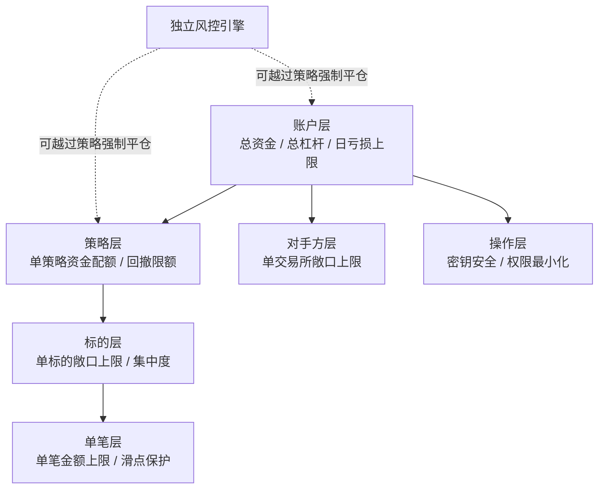

# 05 · 风险管理与组合构建

> **风控先于 alpha。** 这不是口号，是顺序要求：没写好仓位公式和熔断规则之前，不许上实盘，哪怕是 100 U。
>
> 原因很简单：**alpha 决定你赚多少，风控决定你能不能留在场上。** 一次爆仓归零，之前所有的 alpha 都归零。

---

## 一、这一章的核心命题

大多数人的失败不是"策略不赚钱"，而是：

| 失败模式 | 根本原因 |
|---|---|
| 一次爆仓归零 | 仓位过大 + 无熔断 |
| 回撤期放弃策略 | 没有预先知道该策略的正常回撤幅度 |
| 顺利时加杠杆，然后被均值回归打回 | 没有固定的仓位规则 |
| 多个策略同时亏损 | 以为分散了，实际都暴露在同一风险因子上 |
| 实盘远差于回测 | 没有实盘运维能力，在线率低、错单多 |

**这五条全部是风险管理问题，不是 alpha 问题。**

---

## 二、章节

| 文件 | 内容 |
|---|---|
| [01-position-sizing-kelly.md](./01-position-sizing-kelly.md) | 仓位公式、Kelly、波动率目标、杠杆的真实代价 |
| [02-portfolio-construction.md](./02-portfolio-construction.md) | 多策略组合、风险预算、相关性管理 |
| [03-risk-management-drawdown.md](./03-risk-management-drawdown.md) | 风险类型、限额体系、三级熔断、压力测试 |
| [04-live-trading-ops.md](./04-live-trading-ops.md) | 上线检查清单、监控、对账、故障处理、复盘 |

---

## 三、风险层级（自上而下）



**关键设计：风控引擎必须独立于策略，且能单方面杀掉策略。** 如果风控是策略代码的一部分，策略的 bug 就能绕过风控。这是我在后端做权限与限额系统的标准思路。

---

## 四、我的硬性规则（写下来就不改）

在任何实盘之前，把这些数字填死：

```yaml
# 账户层
total_capital: ___              # 可完全亏掉的金额
max_gross_leverage: 1.0         # 起步不加杠杆
max_daily_loss_pct: 3           # 单日亏损上限，触发即停止当日交易
max_drawdown_pct: 15            # 总回撤上限，触发即全部停止并复盘

# 策略层
max_capital_per_strategy_pct: 40
max_strategy_drawdown_pct: 10   # 单策略回撤上限，触发即停该策略

# 标的层
max_exposure_per_symbol_pct: 20
max_correlated_group_pct: 50    # 相关性 > 0.7 的标的合计上限

# 对手方层
max_capital_per_venue_pct: 40   # 单交易所资金上限
hot_wallet_max_pct: 20          # 交易所/热钱包资金比例上限

# 单笔层
max_order_pct_of_depth: 20      # 单笔不超过盘口深度的比例
max_slippage_bps: 30            # 超过则放弃这笔交易
```

**这些数字的具体值可以调整，但必须在实盘前确定，并且只能在冷静期（非亏损中）修改。**

亏损中修改风控参数 = 破产的标准路径。

---

## 五、出口标准

1. 你的仓位公式是什么？它依赖哪些输入？输入估计错了会怎样？
2. 全 Kelly 为什么在实务中不能用？分数 Kelly 用多少合适？
3. 波动率目标（vol targeting）怎么实现？它在什么情况下会失效或加剧亏损？
4. 你的三级熔断规则是什么？每一级触发后具体做什么？
5. 两个策略历史相关性 0.1，为什么在危机中可能同时亏损？怎么防？
6. 实盘系统必须监控哪些指标？哪些需要立即告警？
7. 如果你的策略连续亏损 20 次，你怎么判断"这是正常波动"还是"策略失效了"？
8. 交易所突然无法下单，你的系统怎么反应？

第 7 题最难，也最重要。答案在 [`03-risk-management-drawdown.md`](./03-risk-management-drawdown.md)。

---

## 六、参考

- Carver, *Systematic Trading*（**仓位与风险管理的最实用来源**，波动率目标法出自这里）
- Thorp, "The Kelly Criterion in Blackjack, Sports Betting, and the Stock Market"
- López de Prado, *AFML*, Ch.10（下注规模）、Ch.16（HRP）
- Grinold & Kahn, *Active Portfolio Management*（组合构建理论）
- Taleb, *Antifragile* / *Skin in the Game*（尾部风险的思维方式，不是技术书但值得读）
