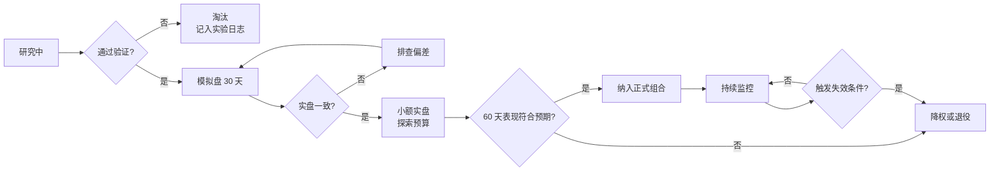

# 02 · 组合构建

> **多策略组合是个人量化最被低估的杠杆。**
>
> 把两个夏普 0.8 的低相关策略组合起来，组合夏普可能达到 1.1。这个提升，比在单一策略里调参能得到的多得多，而且更稳健（不需要新的 alpha，只需要不相关）。

---

## 一、分散化的数学

### 组合夏普

N 个等权、等夏普、两两相关性为 ρ 的策略：

```
组合夏普 = 单策略夏普 × √(N / (1 + (N−1)ρ))
```

| N | ρ = 0 | ρ = 0.3 | ρ = 0.7 |
|---|---|---|---|
| 2 | ×1.41 | ×1.24 | ×1.08 |
| 4 | ×2.00 | ×1.51 | ×1.13 |
| 10 | ×3.16 | ×1.74 | ×1.17 |

### 三个结论

1. **相关性是关键，不是数量**。10 个相关性 0.7 的策略，效果不如 2 个相关性 0 的策略。
2. **前几个策略的边际收益最大**。从 1 个到 2 个策略的提升，远大于从 9 个到 10 个。
3. **ρ 高时增加策略数量几乎没用**。别为了"分散"而堆砌本质相同的策略。

**推论：找到一个与现有策略负相关或零相关的策略，价值远高于把现有策略的夏普提高 20%。**

---

## 二、策略间相关性的真实结构

### 天然低相关的策略组合

| 组合 | 为什么低相关 |
|---|---|
| **趋势跟踪 + 均值回归** | 前者在趋势市赚钱，后者在震荡市赚钱。**这是最经典也最有效的组合** |
| 时间序列动量 + 截面动量 | 前者有市场暴露，后者近似中性 |
| 方向性策略 + delta 中性套利 | 收益来源完全不同 |
| 不同频率的同类策略 | 日内反转 vs 周级动量 |
| 不同资产类别 | crypto 里较难（都跟 BTC 走） |

### 危机中相关性趋于 1

**这是分散化最大的谎言。** 平静期相关性 0.2 的策略，在极端行情中可能同时亏损。

原因：
- 所有策略都在同一个流动性池里，流动性枯竭时全部受影响
- 杠杆被迫去化 → 所有资产同时被抛售
- crypto 里所有资产都对 BTC 有暴露
- 交易所层面的风险（宕机、限流）同时影响所有策略

### 应对：按压力场景做风险预算

不用历史平均相关性做规划，而是：

```
1. 用历史平均相关性算"正常情况"的组合风险
2. 用 ρ = 1 的假设算"压力情况"的组合风险
3. 确保压力情况下的损失也在可承受范围内
4. 按压力情况定杠杆上限，不是按正常情况
```

**这一条会让你的杠杆看起来很保守。这是对的。**

---

## 三、权重分配方法

| 方法 | 输入需求 | 评价 |
|---|---|---|
| **等权（1/N）** | 无 | **基线，非常难打败。起步就用它** |
| 逆波动率加权 | 各策略波动率 | 简单有效，是风险平价的近似 |
| **风险平价** | 协方差矩阵 | 每个策略贡献相同风险，不需要预测收益 |
| **HRP（层次风险平价）** | 协方差矩阵 | 用聚类树分配，不求逆，对估计误差稳健 |
| 最小方差 | 协方差矩阵 | 可能过度集中在低波动策略 |
| 均值-方差 | 协方差 + 预期收益 | ⚠️ 对预期收益估计误差极度敏感，实务慎用 |
| 夏普加权 | 各策略历史夏普 | 容易追逐近期表现好的策略（时间序列上的追涨） |

### 我的选择顺序

```
1. 起步：等权（策略少于 4 个时，等权几乎是最优的）
2. 策略数 ≥ 4：逆波动率或风险平价
3. 策略数 ≥ 8 且有可靠的相关性估计：HRP
4. 永远不用：纯均值-方差优化
```

**为什么强调等权**：见 [`00-foundations/03-linear-algebra-optimization.md`](../00-foundations/03-linear-algebra-optimization.md) —— 权重优化带来的收益通常小于参数估计误差带来的损失。

### 避免"追逐近期表现"

一个常见错误：把资金从近期表现差的策略挪到表现好的策略。

问题：策略表现有均值回归倾向。你会系统性地在策略即将好转时撤资、在即将变差时加资。

**规则：权重调整必须有明确的规则和周期（如季度再平衡），不能因为"某个策略最近表现好"而临时调整。**

例外：如果策略触发了"失效条件"（不是"表现差"，而是"逻辑失效的证据"），那应该停掉它。区分这两者是关键，见 [`03-risk-management-drawdown.md`](./03-risk-management-drawdown.md)。

---

## 四、风险预算

不按资金分配，按**风险贡献**分配。

### 风险贡献的计算

```
策略 i 的边际风险贡献 = w_i × (Σw)_i / σ_p
所有策略的风险贡献之和 = 组合总风险
```

### 风险预算的实用做法

```yaml
total_risk_budget: 15%          # 目标组合年化波动率
allocation:
  trend_following: 40%          # 占风险预算的比例，不是资金比例
  mean_reversion: 30%
  funding_carry: 20%
  experimental: 10%             # 新策略的探索额度
```

关键点：
- **资金比例 ≠ 风险比例**。低波动的 carry 策略可能占 50% 资金但只占 20% 风险
- 新策略给小额"探索预算"，验证后再提升
- 风险预算是硬约束，超了就要减仓

### 探索预算的价值

留一个固定的小额度给"还没充分验证的策略"。好处：
- 能持续获得新策略的实盘数据（回测永远不够）
- 亏损被限定在可接受范围
- 避免"要么不做要么全押"的二元决策

**建议：探索预算 ≤ 10% 风险预算，且单个实验性策略 ≤ 3%。**

---

## 五、组合层面的额外约束

必须加的约束（否则优化器会给出荒谬的解）：

| 约束 | 原因 |
|---|---|
| 单策略权重上下限 | 防集中 |
| 总杠杆上限 | 防过度暴露 |
| 单标的合计敞口上限（跨策略） | **多个策略可能同时看多同一个币** |
| 相关性分组上限 | 相关性 > 0.7 的标的合计上限 |
| 单交易所敞口上限 | 对手方风险 |
| 换手率约束/成本惩罚 | 否则优化器天天大换手 |
| 流动性约束 | 权重不能超过标的的可交易容量 |

### "单标的跨策略合计敞口"最容易漏

趋势策略看多 BTC、动量策略也看多 BTC、carry 策略持有 BTC 现货 —— 三个策略加起来的 BTC 敞口可能远超你的预期。

**必须有一个统一的持仓视图，跨策略汇总敞口。** 这是工程问题：需要一个中央的 position aggregator。我的后端经验在这里直接可用。

---

## 六、策略生命周期管理

组合不是静态的，需要管理策略的进出。



### 进入的条件

- 通过完整的回测陷阱检查（11 项）
- 模拟盘 30 天，实盘-回测偏差可解释
- 小额实盘 60 天，无异常
- 与现有组合的相关性 < 0.7

### 退役的条件（必须预先定义）

- 触发预先写下的"失效条件"
- 回撤超过该策略的历史最大回撤 × 1.5
- 实盘表现连续 N 个月显著低于回测预期（用统计检验，不用感觉）
- 收益来源的结构性前提消失（如交易所改了费率结构）

**关键：退役条件必须在上线前写好。** 在亏损中决定"要不要停"，一定会做出错误决策。

---

## 七、动手清单

- [ ] 实现组合夏普的解析计算，验证上面的表格
- [ ] 计算你的策略两两相关性矩阵（用日收益率）
- [ ] 计算极端行情时段（找出历史最差的 20 天）的相关性，对比平静期
- [ ] 实现等权、逆波动率、风险平价、HRP 四种权重方案，做样本外对比
- [ ] 实现风险贡献计算，验证风险预算是否符合设定
- [ ] 实现跨策略的持仓聚合视图（position aggregator）
- [ ] 实现组合层约束检查（上表 7 项）
- [ ] 做压力测试：ρ = 1 假设下的组合损失，验证是否可承受
- [ ] 组合趋势 + 均值回归两个策略，量化组合夏普 vs 单策略夏普的提升
- [ ] 写下策略进入与退役的具体条件，固化到配置

---

## 参考

- Grinold & Kahn, *Active Portfolio Management*（组合构建与信息法则的理论基础）
- López de Prado, *AFML*, Ch.16（HRP）；*Machine Learning for Asset Managers*（NCO 方法）
- Carver, *Systematic Trading*（多策略组合的实操，"forecast diversification"概念很有用）
- Roncalli, *Introduction to Risk Parity and Budgeting*（风险平价的系统论述）
- DeMiguel, Garlappi & Uppal, "Optimal Versus Naive Diversification"（1/N 为什么难打败）
- [`00-foundations/03-linear-algebra-optimization.md`](../00-foundations/03-linear-algebra-optimization.md)：协方差估计的问题
