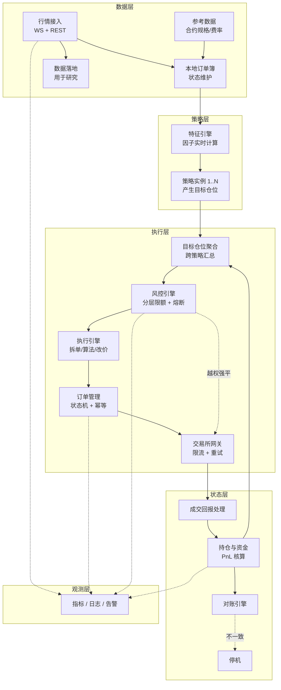

# 01 · 交易系统架构

> 设计目标排序：**正确性 > 可靠性 > 可观测性 > 性能**。
>
> 大多数个人交易系统的失败不是"太慢"，是"出错了没发现"或"错了没法恢复"。

---

## 一、整体架构



---

## 二、模块职责与失败行为

**每个模块必须明确定义"失败时怎么办"。** 这是可靠性设计的核心。

| 模块 | 职责 | 失败时的行为 |
|---|---|---|
| 行情接入 | WS 订阅、REST 补齐 | 断线自动重连；超过 N 秒无数据 → 通知策略进入降级 |
| 本地订单簿 | 维护深度状态 | 序列号断裂 → 重新拉 snapshot；重建期间标记数据不可用 |
| 参考数据 | 合约规格、费率、精度 | 加载失败 → 拒绝启动（**不允许用默认值猜**） |
| 特征引擎 | 实时因子计算 | 输入缺失 → 输出 NaN 并标记；策略必须处理 NaN |
| 策略 | 产生目标仓位 | 抛异常 → 该策略隔离停止，不影响其他策略 |
| 目标仓位聚合 | 跨策略汇总敞口 | 聚合失败 → 不下单 |
| **风控引擎** | 分层限额检查 | **检查失败 → 拒绝下单（fail-safe）** |
| 执行引擎 | 拆单、算法执行、改价 | 执行超时 → 撤单并上报 |
| 订单管理 | 状态机、幂等 | 状态未知 → 查询确认；确认不了 → 停机告警 |
| 交易所网关 | 限流、重试、错误映射 | 限流 → 退避；持续失败 → 停止该所 |
| 成交回报处理 | 更新持仓 | 回报丢失 → 定期全量拉取补齐 |
| 持仓与资金 | PnL 核算 | 计算异常 → 停机（**资金计算不允许出错**） |
| 对账引擎 | 三源一致性 | 不一致 → **停止下单，人工介入** |

### 两个关键设计

**1. 风控引擎必须独立且不可绕过**

```
策略 → 目标仓位 → 【风控】→ 执行
                    ↑
              策略无法绕过这一层
```

如果风控是策略的一部分，策略的 bug 就能绕过风控。这是我在后端做权限系统的标准思路：**权限检查必须在被保护资源之前，且不由调用方控制。**

**2. 参考数据加载失败必须拒绝启动**

用默认值猜精度/最小下单量，会导致下单被拒或数量错误。**宁可不启动，不要带着错误的假设运行。**

---

## 三、目标仓位模式（推荐的策略接口设计）

### 两种策略接口

| 模式 | 策略输出 | 特点 |
|---|---|---|
| 事件式 | "买入 0.5 BTC" | 直观，但状态难管理；重启后不知道该有多少仓位 |
| **目标仓位式** | "我希望持有 0.5 BTC" | **推荐**：幂等、状态清晰、重启后能自动收敛 |

### 为什么目标仓位式更好

```python
# 目标仓位模式的核心循环
target = strategy.get_target_position()      # 策略只说"我想要什么"
current = portfolio.get_current_position()   # 系统知道"现在有什么"
delta = target - current                     # 系统算出"要做什么"
if abs(delta) > min_trade_threshold:         # 死区，避免微调
    execute(delta)
```

好处：
- **幂等**：重复执行不会累加仓位
- **重启安全**：启动后自然收敛到目标
- **策略与执行解耦**：策略不关心怎么成交
- **易于跨策略聚合**：多个策略的目标可以相加
- **易于风控**：直接对目标仓位做限额检查

**这是我会采用的默认设计。** 事件式接口在多策略、有故障恢复需求的系统里会带来大量状态管理问题。

### 死区（threshold）的重要性

没有死区，目标仓位的微小变化会导致持续的小额交易，成本会吃掉收益。

```
死区规则：|delta| < max(最小下单量, 目标仓位 × 5%) 时不交易
```

---

## 四、并发模型

| 方案 | 说明 | 适用 |
|---|---|---|
| 单线程事件循环 | 所有逻辑在一个线程，按事件顺序处理 | **推荐起步**：无锁、可复现、易调试 |
| 单线程 + 异步 IO | asyncio 处理网络 IO | Python 的实用选择 |
| 多线程 + 消息队列 | 行情、策略、执行分线程 | 需要小心竞态 |
| 多进程 | 策略隔离在独立进程 | 隔离性好，适合多策略 |
| Actor 模型 | 每个组件是独立 actor | 概念清晰 |

### 我的建议

```
起步：单线程 asyncio（行情 IO 异步，策略逻辑同步）
多策略：每个策略独立进程，通过共享的仓位聚合器协调
性能瓶颈时：把热路径（订单簿维护、特征计算）移到 Rust
```

**关键原则：状态变更尽量单线程。** 并发 bug 在交易系统里的代价极高，而且难以复现。

从后端经验看：**能用单线程解决的问题，不要引入并发。** 交易系统的吞吐量需求（个人规模）远低于单线程的能力上限。

---

## 五、配置管理

```
config/
├── venues.yaml          # 交易所规格：费率、精度、限流、订单类型支持
├── universe.yaml         # 标的池定义
├── strategies/
│   ├── trend_v1.yaml     # 每个策略的参数
│   └── carry_v1.yaml
├── risk.yaml             # 风控限额
└── ops.yaml              # 监控、告警、日志配置
```

### 硬性规则

1. **零硬编码**：所有参数从配置读取
2. **配置进版本控制**：能追溯"当时用的什么参数"
3. **配置校验**：启动时校验 schema 和取值范围，不合法拒绝启动
4. **生产/测试隔离**：物理隔离，防止误用生产密钥
5. **密钥不在配置文件里**：用环境变量引用或 keychain/KMS
6. **配置变更有审计**：谁在什么时候改了什么

### venues.yaml 的价值

把每个交易所的差异结构化，策略层从配置读取而不是写 if-else：

```yaml
binance_futures:
  fees: { maker: 0.0002, taker: 0.0005 }
  funding_interval_hours: 8
  supports: { post_only: true, reduce_only: true, limit_ioc: true }
  rate_limit: { weight_per_minute: 2400 }
  price_precision_source: exchange_info
  mark_price_index_components: [...]
```

**这是我做多渠道接入的标准套路。** 新接一个交易所变成"填一份配置 + 写一个 adapter"，而不是到处改代码。

---

## 六、测试策略

| 层级 | 内容 | 重点 |
|---|---|---|
| 单元测试 | 成本计算、仓位计算、PnL 累加、信号对齐 | **这四处的 bug 最贵** |
| 状态机测试 | 订单所有合法/非法状态转换 | |
| 幂等测试 | 重复消息、乱序消息、超时重试 | |
| 集成测试 | 用录制的行情回放，验证端到端行为 | |
| **故障注入** | 断网、拒单、限流、超时、进程被杀 | **最有价值的测试** |
| 回归测试 | 固定输入产生固定输出 | 防止改动引入偏差 |
| 模拟盘 | 真实行情 + 模拟撮合，长时间运行 | 发现长尾问题 |

### 故障注入的具体清单

- [ ] 拔网线（WS 断线）
- [ ] 交易所返回限流错误
- [ ] 交易所返回拒单
- [ ] 下单请求超时（但实际成功）
- [ ] 成交回报丢失
- [ ] 收到重复的成交回报
- [ ] 收到乱序的回报
- [ ] 进程被 kill -9（验证重启恢复）
- [ ] 磁盘写满
- [ ] 时钟跳变
- [ ] 交易所返回意外的字段/格式

**每一项都要验证系统的行为符合预期，而不是"崩了"或"静默出错"。**

---

## 七、动手清单

- [ ] 画出你的系统架构图，标注每个模块的失败行为
- [ ] 实现目标仓位模式的策略接口（含死区）
- [ ] 实现 `venues.yaml` 配置与 adapter 模式
- [ ] 实现配置校验（启动时 schema + 范围检查）
- [ ] 实现单线程 asyncio 主循环
- [ ] 实现跨策略的仓位聚合器
- [ ] 实现独立的风控引擎（策略不可绕过）
- [ ] 写单元测试覆盖：成本、仓位、PnL、信号对齐
- [ ] 写订单状态机测试
- [ ] 实现行情录制与回放（用于集成测试）
- [ ] 完成故障注入清单全部 11 项
- [ ] 验证"出差一周"标准：连续运行 7 天无人工干预

---

## 参考

- `nautilus_trader` 架构文档与源码（**核心参考**）
- Kleppmann, *Designing Data-Intensive Applications*（状态、一致性、容错的通用原理）
- Google, *Site Reliability Engineering*（可靠性工程实践）
- `hummingbot` 的 connector 设计（多交易所适配的实现参考）
- [`03-oms-ems-and-reconciliation.md`](./03-oms-ems-and-reconciliation.md)：订单管理的深入细节
