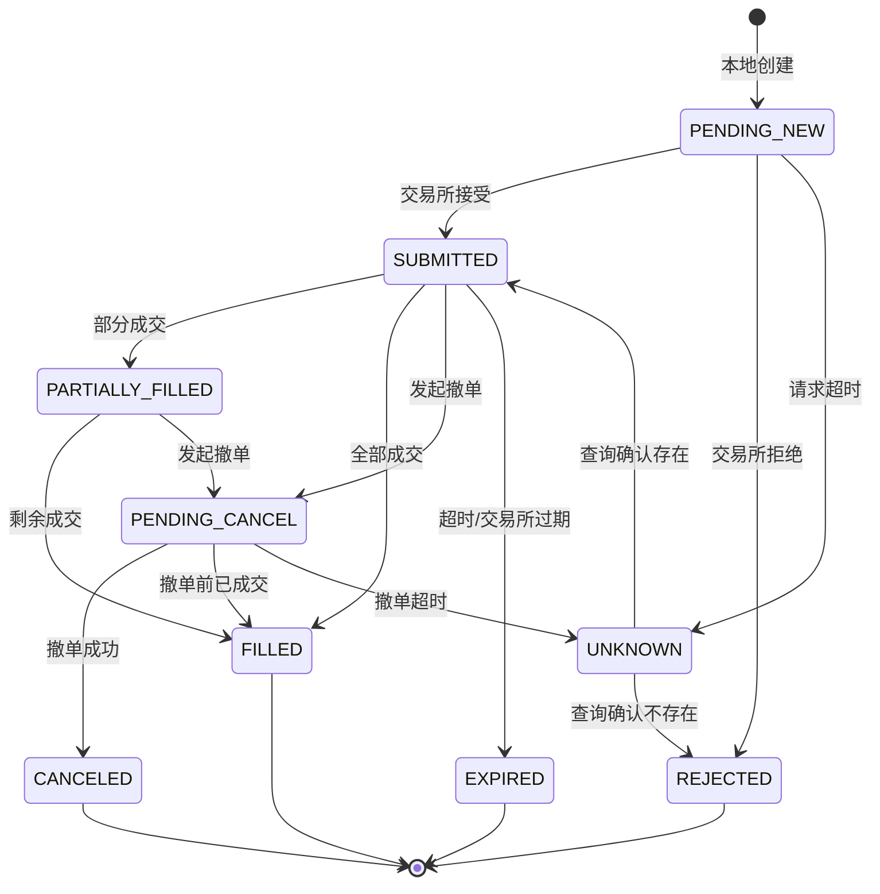

# 03 · 订单管理、执行与对账

> 这一章是交易系统里**最容易出灾难性 bug** 的地方，也是我经验最直接可用的地方（订单系统 + 资金账务 + 幂等消费）。
>
> 核心命题：**在一个消息可能丢失、重复、乱序，请求可能超时但实际成功的环境里，如何保证账目永远正确。**

---

## 一、OMS vs EMS

| | OMS（订单管理系统） | EMS（执行管理系统） |
|---|---|---|
| 关注 | 订单的**状态与生命周期** | 订单的**执行方式** |
| 职责 | 状态机、幂等、持久化、对账 | 拆单、算法执行、改价、路由 |
| 失败后果 | **账目错误**（最严重） | 成本升高 |
| 我的重点 | **这个** | 次之 |

个人系统里两者可以合在一起，但**职责要分清**：EMS 决定"怎么下"，OMS 保证"记录准确"。

---

## 二、订单状态机



### UNKNOWN 状态是关键

大多数人的实现里没有 `UNKNOWN` 状态，这是最大的设计缺陷。

**场景**：你发出下单请求，网络超时。订单可能已经提交了，也可能没有。

- 如果你假设"没提交"并重试 → **可能重复下单**
- 如果你假设"提交了" → 可能实际没有，仓位不对

**正确做法**：进入 `UNKNOWN` 状态，通过查询确认，确认前不做任何假设。

### 状态机的实现要求

| 要求 | 说明 |
|---|---|
| 只允许合法转换 | 非法转换抛异常并告警（说明有 bug 或收到了脏数据） |
| 幂等 | 同一个事件重复到达不改变状态 |
| 持久化 | 每次状态变更落盘，重启后能恢复 |
| 单调性 | 用交易所提供的更新序号防止旧消息覆盖新状态 |
| 完整审计 | 记录每次状态变更的时间、原因、原始消息 |

**"单调性"这条很重要**：WebSocket 消息可能乱序到达。如果用旧消息覆盖了新状态，账目就错了。用交易所的 `updateTime` 或序号做守卫。

---

## 三、幂等设计（防重复下单）

### 客户端订单 ID

```python
client_order_id = f"{strategy_id}-{symbol}-{epoch_ms}-{seq}"
```

要求：
- **全局唯一**（含策略标识，防止多策略冲突）
- **可复现**（重试时用同一个 ID，让交易所去重）
- 符合交易所的格式限制（长度、字符集）
- 可解析（从 ID 能反推出是哪个策略、什么时候）

### 安全下单流程

```python
async def safe_place_order(order):
    order.state = PENDING_NEW
    persist(order)                        # 先落盘，再发请求

    try:
        resp = await api.place(order)
        order.apply(resp)
        return order
    except (Timeout, NetworkError):
        order.state = UNKNOWN
        persist(order)
        # 不要立刻重试！先确认
        return await resolve_unknown(order)

async def resolve_unknown(order):
    for attempt in range(MAX_RETRY):
        existing = await api.query_by_client_id(order.client_order_id)
        if existing is not None:
            order.apply(existing)         # 已提交，用交易所状态
            return order
        if is_definitely_not_submitted(existing):
            order.state = REJECTED        # 确认未提交，可以重新下
            return order
        await sleep(backoff(attempt))

    alert("订单状态无法确认，停止交易")     # 确认不了就停机
    halt_trading()
```

### 三条铁律

1. **先落盘，再发请求**。否则进程崩溃后你不知道自己下过什么单。
2. **超时不等于失败**。必须查询确认。
3. **确认不了就停机**。带着未知状态继续交易，会让错误累积。

第 3 条最反直觉但最重要。**宁可停机人工处理，不要自动"猜"。**

---

## 四、成交回报处理

### 处理原则

| 原则 | 说明 |
|---|---|
| 幂等 | 用 `trade_id` 去重（同一笔成交可能推送多次） |
| 顺序无关 | 处理逻辑不依赖到达顺序（用累计量而非增量） |
| 补齐机制 | 定期全量拉取成交列表，补齐遗漏的推送 |
| 精度 | 用整数最小单位或 Decimal 累加，不用 float |
| 分离已实现与未实现 | PnL 核算要分开 |

### 累计量 vs 增量

**推荐用累计量**：

```python
# 增量方式（脆弱）
position += fill.qty        # 丢一条消息就永久错了

# 累计量方式（健壮）
position = order.cumulative_filled_qty    # 从交易所的累计值同步
```

交易所的成交回报通常带 `cumQty`（累计成交量）。用它而不是自己累加，能自动容忍消息丢失和重复。

**这是我在消息队列消费里的标准做法：能用幂等的绝对值同步，就不要用增量累加。**

---

## 五、精度与账务

### float 会害死你

```python
0.1 + 0.2 == 0.30000000000000004    # 经典问题
```

跑几万笔交易之后，浮点累加误差会让你和交易所对不上账。

### 正确做法

| 方案 | 说明 |
|---|---|
| **整数最小单位** | 价格和数量都用整数（乘以 10^precision），像 satoshi/wei 一样 |
| Decimal | Python 的 `decimal.Decimal`，精确但慢 |
| 定点数 | 自己实现，性能好 |

**推荐：内部用整数最小单位，展示时转换。** 这是我做资金系统的标准做法。

### 精度处理规则

| 场景 | 规则 |
|---|---|
| 下单数量 | 向下取整到交易所精度（**不要向上，可能超出可用余额**） |
| 下单价格 | 买单向下取整，卖单向上取整（保守方向） |
| 最小下单量 | 检查是否满足，不满足则跳过（不要下一个会被拒的单） |
| 最小名义价值 | 很多交易所有 min notional 要求 |
| 余额检查 | 留缓冲（如 99%），避免因手续费导致余额不足 |

---

## 六、对账（reconciliation）

### 三源对账

```
意图状态（策略想要的） ←→ 本地状态（系统记录的） ←→ 交易所状态（真实的）
```

| 对比 | 频率 | 不一致含义 |
|---|---|---|
| 本地挂单 vs 交易所挂单 | 每分钟 | 有孤儿单或幽灵单 |
| 本地持仓 vs 交易所持仓 | 每分钟 | 成交处理有遗漏或错误 |
| 本地余额 vs 交易所余额 | 每 5 分钟 | 手续费/资金费核算错误 |
| 本地成交明细 vs 交易所成交明细 | 每日 | 完整核对 |
| 本地 PnL vs 交易所 PnL | 每日 | 核算逻辑错误 |

### 不一致的分类处理

| 类型 | 处理 |
|---|---|
| **孤儿单**（交易所有，本地没有） | 立即撤销；排查为什么会产生 |
| **幽灵单**（本地有，交易所没有） | 标记为已消失；排查 |
| 持仓小额偏差（< 最小精度） | 以交易所为准同步 |
| **持仓显著偏差** | **立即停止下单，人工核对** |
| 余额偏差 | 检查手续费/资金费的核算 |
| 外部干预（手动交易/强平/ADL） | 系统要能识别并接受，不要试图"纠正" |

### 关键原则

1. **交易所是唯一真相来源（source of truth）**。不一致时以交易所为准。
2. **显著不一致 = 停机**。不要自动修复。
3. **每次不一致都要写复盘**。不一致是 bug 的症状，不是随机噪声。
4. **系统要能识别外部变更**（强平、ADL、手动操作），不要把它当作 bug。

第 4 条容易漏：如果被强平了，系统必须能感知并更新状态，而不是"疑惑为什么持仓不对"然后试图恢复原仓位（那会造成灾难）。

---

## 七、EMS：执行层

| 功能 | 说明 |
|---|---|
| 拆单 | 大单拆成小单，按算法执行 |
| 算法选择 | TWAP / POV / post-only 挂单 / IOC |
| 改价逻辑 | 挂单价格跟随市场，但要**节流**（避免触发限流，也避免频繁丢失队列位置） |
| 超时转换 | post-only 挂单超时后转 IOC 成交 |
| 路由 | 多交易所时选择最优场所 |
| 单腿处理 | 多腿策略中一腿失败的应急逻辑 |
| 限流管理 | 令牌桶，预留额度给撤单（**撤单比下单更紧急**） |

### 限流额度要给撤单预留

极端行情时，你最需要的是"能撤单"。如果限流额度被下单占满，撤不掉单会造成巨大损失。

**规则：限流预算分配，撤单优先级高于下单，且保留固定额度。**

### 改价节流

做市/挂单策略需要跟随市场改价，但：
- 改价 = 撤单 + 重下 = 丢失队列位置 + 消耗限流额度
- 不改价 = 报价过时 = 逆向选择风险

**做法**：设置改价阈值（价格偏离超过 N 个 tick 才改）+ 最小改价间隔。

---

## 八、动手清单

- [ ] 实现完整订单状态机（**含 UNKNOWN 状态**），写全部转换的测试
- [ ] 实现 client_order_id 生成与解析
- [ ] 实现 `safe_place_order` + `resolve_unknown` 流程
- [ ] 实现"先落盘再发请求"的持久化
- [ ] 实现成交回报的幂等处理（trade_id 去重 + 累计量同步）
- [ ] 实现消息乱序守卫（用交易所更新序号）
- [ ] 把所有金额改为整数最小单位，写精度测试
- [ ] 实现精度处理（下单数量/价格的正确取整方向）
- [ ] 实现三源对账，多频率运行
- [ ] 实现孤儿单/幽灵单的检测与处理
- [ ] 实现外部变更识别（强平/ADL/手动操作）
- [ ] 实现限流令牌桶，为撤单预留额度
- [ ] 实现改价节流逻辑
- [ ] 故障注入测试：超时但成功、重复回报、乱序回报、进程被杀

---

## 参考

- `nautilus_trader` 的 OMS 与 ExecutionEngine 实现（**最好的开源参考**）
- `hummingbot` 的订单跟踪与对账实现
- Kleppmann, *Designing Data-Intensive Applications*（幂等、恰好一次语义、状态同步）
- 各交易所 API 文档的错误码、订单查询、成交查询章节
- FIX 协议的订单状态定义（业界标准的状态机设计参考）
