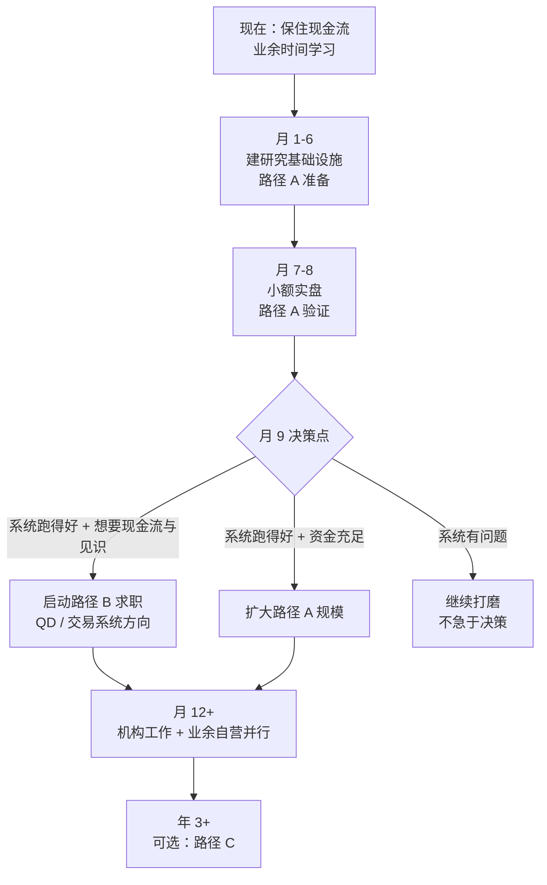

# 01 · 三条路的详细分析

> 把每条路的门槛、真实收入形态、失败模式摊开来看。
>
> 目的不是选出"最好的路"，而是选出**"我能走通的路"**。

---

## 路 A：自有资金自营

### 真实图景

用自己的钱交易，赚多少是多少。没有老板、没有 LP、没有合规约束。

### 门槛

| 项 | 说明 |
|---|---|
| 资金 | 决定了绝对收益。10 万本金年化 30% = 3 万，不够生活 |
| 策略 | 需要真实有效且容量匹配你的资金 |
| **心理** | 最被低估的门槛。回撤期的心理承受力 |
| 时间 | 系统化之后不需要盯盘，但研究和运维需要时间 |
| 工程 | 系统稳定性直接影响收益 |

### 资金规模的现实算术

假设一个不错的系统化策略：年化 20%、最大回撤 15%（这已经是相当好的水平）。

| 本金 | 年收益 | 能否替代工资 |
|---|---|---|
| 10 万 | 2 万 | ❌ 完全不够 |
| 50 万 | 10 万 | ❌ 不够 |
| 200 万 | 40 万 | ⚠️ 勉强，但一年回撤能亏掉 30 万 |
| 500 万 | 100 万 | ✅ 可以，但回撤能亏 75 万 |

**关键洞察：自营的瓶颈是资金，不是策略。**

而且要注意：**你必须能承受"回撤金额"，不只是"收益金额"**。200 万本金遇到 15% 回撤是亏 30 万 —— 如果这个数字会让你失眠或者改变策略，那你的资金规模就还不够。

### 失败模式（按发生频率）

1. **爆仓归零**：杠杆过高 + 无熔断
2. **回撤中放弃**：在策略正常的水下期停掉它，然后错过恢复
3. **不断换策略**：追逐近期表现好的，实际是在时间序列上追涨
4. **成本吞噬**：换手太高，手续费吃掉全部收益
5. **交易所出事**：非市场风险
6. **系统 bug**：错单、重复下单
7. **温水煮青蛙**：长期小亏，一直觉得"再改改就好了"
8. **生活压力干扰决策**：需要用钱时被迫平仓

**注意：只有第 1 和第 4 是"策略/市场"问题，其他全是心理、工程、生活问题。**

### 我的适配度：中

- ✅ 工程能力强，能把系统做稳
- ✅ 有 crypto 一线经验
- ⚠️ 资金是硬瓶颈
- ⚠️ 心理承受力未经系统化交易的验证（手动交易和系统化交易的心理压力不同）
- ❌ 无法作为唯一收入来源（短期内）

**结论：A 作为验证和长期积累，不作为主线。**

---

## 路 B：加入量化机构

### 岗位类型

见 [`02-quant-job-market-and-interview.md`](./02-quant-job-market-and-interview.md) 的详细分析。简版：

| 岗位 | 核心要求 | 我的匹配度 |
|---|---|---|
| QR（量化研究员） | 数学、统计、ML；常见 PhD | 低-中 |
| **QD（量化开发）** | **系统、性能、可靠性** | **高** |
| QT（量化交易员） | 实时判断、风险感、策略运维 | 中 |
| 交易系统架构师 | 架构 + 交易业务 | **高** |
| 数据工程 | 数据管道、存储、质量 | **高** |

### 机构类型

| 类型 | 特点 | 对我 |
|---|---|---|
| Crypto 量化基金 / 做市商 | 门槛相对低，重视 crypto 经验 | ✅ **最匹配** |
| 交易所（撮合/风控/衍生品系统） | 我有直接对口经验 | ✅ **很匹配** |
| 传统自营（Prop）| 门槛高，重视 C++/低延迟 | ⚠️ 需补语言 |
| 传统对冲基金 | 门槛最高，看学历背景 | ❌ |
| 券商/资管的量化部门 | 制度化，节奏慢 | ⚠️ |

### 为什么这是我的主线

| 理由 | 说明 |
|---|---|
| 存量优势直接兑现 | 10 年后端经验不需要贬值重来 |
| **稀缺组合** | "懂 CEX 内部机制 + 强工程 + 有实盘经验"的人不多 |
| 有现金流 | 不需要牺牲生活质量去赌 |
| 学习加速 | 在机构里能看到真实的数据基础设施和策略工程实践 |
| 风险低 | 最坏情况是"工作不合适"，不是"亏光积蓄" |
| 为 A 和 C 铺路 | 攒资金 + 攒经验 + 攒人脉 |

### 失败模式

1. **面试失败**：数学/算法/系统设计任一环节不过关
2. **岗位错配**：进去做纯 CRUD，接触不到交易核心
3. **只做工程没有话语权**：变成"给交易员写代码的人"
4. **文化不适应**：量化机构的节奏和压力

### 应对

| 失败模式 | 应对 |
|---|---|
| 面试失败 | 系统准备，见 `02-quant-job-market-and-interview.md` |
| 岗位错配 | 面试时问清职责范围；优先选小团队（接触面广） |
| 没有话语权 | **有自己的实盘经验和作品** ← 这就是路 A 的价值 |
| 文化不适应 | 面试时多问工作方式；找 crypto 原生团队（文化更接近互联网） |

**第 3 条的应对最重要**：这就是为什么必须并行做路 A。有自己的实盘系统 = 能和交易员平等对话 = 有议价能力。

---

## 路 C：管理外部资金

### 门槛

| 项 | 说明 |
|---|---|
| **Track record** | 至少 2 年，可验证（第三方托管/审计） |
| 合规 | 各司法辖区要求不同，crypto 领域尤其复杂 |
| 募资能力 | 技术好不等于能募到钱 |
| 基础设施 | 托管、报告、风控、审计 |
| 容量 | 策略必须能容纳更大资金 |

### 收入形态

管理费（按 AUM 比例）+ 业绩分成。规模化之后收入上限最高。

### 现实评估

- 需要 2 年以上的可验证记录 → **最早也是第 3 年的事**
- crypto 领域的合规环境在变化，要持续关注
- 募资是完全不同的技能（销售/信任建立），不是技术问题
- 管理别人的钱，心理压力比自己的钱大得多

### 我的适配度：低（现阶段）

**结论：作为远期可能性保留，现在不投入任何精力。** 但要做一件事：**从第一天起就规范记录 track record**（见 [`journal/`](../journal/)）。

规范记录的成本几乎为零，但如果 3 年后想走这条路，没有记录就是从零开始。

---

## 四、组合路径（我的实际选择）

### 关键设计：不做二选一

**路径 A 和 B 不是互斥的。** 在机构工作 + 业余自营是完全可行的（注意合规：很多机构对员工个人交易有限制，面试时要问清楚）。

这个组合的好处：
- 机构提供现金流、见识、基础设施经验
- 自营保持独立判断、积累 track record、验证想法
- 两边的学习互相加速

### 需要注意的合规问题

很多量化机构禁止或限制员工个人交易（防利益冲突）。**面试时必须问清楚**：
- 个人账户交易的政策是什么
- crypto 是否在限制范围内
- 是否需要报备

如果限制严格，那 A 和 B 就变成了真正的二选一，需要重新权衡。**这是我必须在求职前搞清楚的关键信息。**

---

## 五、决策记录（第 9 个月填写）

到时候用真实数据填这张表，然后写决策文档：

| 评估项 | 实际数据 | 对决策的影响 |
|---|---|---|
| 实盘系统在线率 | | |
| 实盘-回测偏差 | | |
| 60 天实盘净收益 | | |
| 最大回撤与我的心理反应 | | |
| 学习进度（vs ROADMAP） | | |
| 可投入的资金规模 | | |
| 市场上 QD 岗位的实际要求与薪资 | | |
| 目标机构的个人交易政策 | | |
| 家庭/生活的现金流需求 | | |

**决策文档要写清楚：选了什么，放弃了什么，为什么，以及什么条件下会改变决定。**

---

## 参考

- Chan, *Quantitative Trading*（作者的个人经历就是路 A 到 C 的完整案例）
- Narang, *Inside the Black Box*（机构内部视角）
- Patterson, *The Quants*（行业历史与人物，了解生态）
- 各 crypto 量化机构与交易所的招聘页面
- [`03-self-trader-capital-plan.md`](./03-self-trader-capital-plan.md)：资金与心理的具体规划
