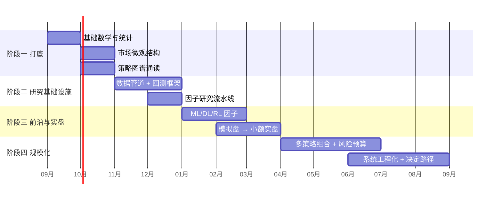

# 量化交易转型路线图（12 个月）

> 目标：从"会写高并发后端 + 会手动交易 Crypto"，变成"能跑系统化策略、能管住风险、能持续迭代"的量化交易者。
>
> 判断成功的唯一标准不是"学完了多少"，而是：**是否有一套连续运行 6 个月以上、风险可控、正期望的实盘系统。**

---

## 零、先把话说清楚

### 这条路的真实难度

- 量化不是"写个策略然后躺赚"。真实分布是：**90% 的时间在做数据清洗、回测验证、排查偏差、修实盘 bug**，10% 的时间在想策略。
- 绝大多数公开策略在扣掉手续费、滑点、资金费之后是负期望。**成本模型比 alpha 模型更决定生死。**
- 个人做量化最大的优势不是模型，是**容量小、灵活、能吃机构吃不下的小规模机会**（小市值、冷门合约、短窗口的结构性错价）。
- 最大的劣势是：数据成本、延迟、抗回撤的心理与资金能力。

### 我的三个真实约束

| 约束 | 现状 | 应对 |
|---|---|---|
| 资金 | 有限，不能扛大回撤 | 前 6 个月只用"可完全亏掉"的小资金；仓位公式硬约束 |
| 时间 | 需要现金流，转型期不能裸辞 | 优先做低频/中频策略，不碰需要盯盘的手动交易 |
| 能力缺口 | 统计/时间序列/ML 不系统 | 用工程能力换时间：先建研究基础设施，再补模型 |

> 明确一点：**"辞职全职做交易员"不是起点，是终点**。起点是"用业余时间把系统跑通并验证"。

---

## 一、阶段划分

---

## 阶段一：打底（第 1-2 个月）

**目标：建立正确的世界观，知道钱从哪来、为什么会亏。**

### 学什么
- [`00-foundations`](./00-foundations/)：概率统计、收益率与对数收益、平稳性、协整、假设检验、多重检验问题
- [`01-market-microstructure`](./01-market-microstructure/)：限价单簿、撮合规则、买卖价差、市场冲击、maker/taker 费率、perp 资金费、强平与保险基金
- [`02-strategy-zoo`](./02-strategy-zoo/)：把主流策略族按"收益来源"分类，而不是按"指标名字"分类

### 做什么（labs）
- `lab-01-data-collector`：K 线 / 逐笔成交 / 资金费 / 深度快照 落地为 parquet，含增量更新与完整性校验
- `lab-02-first-backtest`：手写一个**事件驱动**回测器（不用现成框架），必须包含手续费、滑点、资金费

### 出口标准
- [ ] 能在白板上讲清：一笔市价单从下单到成交，钱在哪些环节被拿走
- [ ] 能解释"为什么大多数技术指标策略的样本外收益趋于零"
- [ ] 本地有一份至少 2 年、跨 20+ 标的的干净行情数据
- [ ] 自己写的回测器能复现一个已知策略的收益曲线

---

## 阶段二：研究基础设施（第 3-4 个月）

**目标：把"研究"变成流水线，而不是每次都从 Notebook 复制粘贴。**

这是我最该发力的阶段 —— 这一段本质上是**后端工程**，我有存量优势。

### 学什么
- [`03-research-infra`](./03-research-infra/)：数据版本管理、point-in-time 正确性、事件驱动 vs 向量化回测、Walk-forward、CPCV（组合purged交叉验证）、去偏差、评估指标体系
- 重点章：[`03-backtest-pitfalls.md`](./03-research-infra/03-backtest-pitfalls.md) —— 未来函数、幸存者偏差、过拟合、多重检验、成本低估、容量幻觉

### 做什么（labs）
- `lab-03-factor-lab`：因子研究流水线（因子定义 → IC/IR → 分层回测 → 换手与成本 → 稳健性检验）
- 把 `lab-02` 的回测器升级：支持多标的、多策略、参数扫描、结果落库、报告自动生成

### 出口标准
- [ ] 一个新因子从想法到完整评估报告 < 30 分钟（流水线跑通）
- [ ] 回测器支持 walk-forward 和 CPCV
- [ ] 能对任意回测结果回答："这个夏普里有多少是过拟合？容量是多少？"
- [ ] 建立"策略档案"模板：每个策略必须写清收益来源假设与失效条件

---

## 阶段三：前沿与实盘（第 5-8 个月）

**目标：接触真正现代的方法，同时把小额实盘跑起来。研究与实盘并行，实盘优先。**

### 学什么
- [`04-ml-and-frontier`](./04-ml-and-frontier/)：
  - 金融 ML 的特殊性（非 IID、低信噪比、标签构造、三重障碍法、样本权重）
  - 树模型（LightGBM/XGBoost）为什么在表格因子上仍是主力
  - 序列模型（TCN / Transformer）用在什么地方才有意义
  - RL 主要落在**执行优化**而非方向预测
  - LLM 在量化里的真实位置：研究助手、因子挖掘、文本/新闻信号、代码生成 —— 不是"问 LLM 该买还是该卖"
- [`05-risk-and-portfolio`](./05-risk-and-portfolio/)：Kelly 与分数 Kelly、波动率目标、风险平价、相关性聚类、回撤熔断

### 做什么（labs）
- `lab-04-market-maker-sim`：订单簿模拟 + Avellaneda-Stoikov 报价，理解库存风险与逆向选择
- `lab-05-live-paper-trading`：模拟盘 7×24 运行，含监控告警、断线重连、状态对账
- `lab-06-ml-alpha`：一个完整 ML alpha（标签构造 → 特征 → CPCV → 成本敏感性）

### 出口标准
- [ ] 模拟盘连续运行 30 天无人工干预，实盘/回测偏差可解释
- [ ] 小额实盘（可完全亏掉的金额）连续运行 60 天，有完整交易日志
- [ ] ML alpha 的样本外表现与样本内的衰减幅度被量化并被解释
- [ ] 写下明确的仓位公式与三级熔断规则，并在实盘中被触发验证过一次

---

## 阶段四：规模化与定向（第 9-12 个月）

**目标：从单策略变多策略组合；同时决定长期路径。**

### 学什么
- [`06-engineering`](./06-engineering/)：交易系统架构、低延迟工程、OMS/EMS、幂等与对账、灰度与回滚
- [`07-career-and-capital`](./07-career-and-capital/)：自营 / 加入量化机构 / 管理外部资金，三条路的门槛与取舍

### 做什么
- 组合层：2-4 个低相关策略并行，做风险预算而不是简单等权
- 工程层：把系统做到"我出差一周也不用管"
- 路径层：根据前 8 个月的真实数据（不是感觉）决定走哪条路

### 出口标准
- [ ] 多策略组合运行 ≥ 3 个月，组合层夏普 > 单策略最优
- [ ] 系统有完整可观测性：PnL 归因、延迟分布、错单率、资金对账
- [ ] 完成一次"路径决策文档"：写明选择理由与放弃理由
- [ ] 如果走机构路线：完成简历 + 3 个可展示项目 + 面试题库覆盖

---

## 二、路径分叉：三条出路

| 路径 | 门槛 | 收入形态 | 我的适配度 |
|---|---|---|---|
| **A. 自有资金自营** | 资金 + 策略 + 心理 | 直接 PnL，波动大 | 中：资金是瓶颈，但灵活度最高 |
| **B. 加入量化机构** | 面试硬门槛（数学/编程/系统） | 稳定薪资 + 分成 | **高：Crypto 交易所工程背景 + 高并发是稀缺组合，走"量化开发/交易系统"而非"研究员"更现实** |
| **C. 管理外部资金** | 合规 + track record | 管理费 + carry | 低：需要 2 年以上可验证 track record，属于后期选项 |

> 现实建议：**B 为主线，A 为验证**。用自营小资金证明能力，用工程背景进机构拿现金流，两者互相喂养。
> 直接跳到"全职自营交易员"是高风险选择 —— 没有 track record 和资金缓冲的情况下，回撤期会直接摧毁执行纪律。

---

## 三、每阶段的"不做清单"

明确不做，比明确做更重要：

- ❌ 不追求做纯 HFT / 延迟套利。个人对上机构的 colocation + 定制网络栈是必输的仗。
- ❌ 不买"信号群""带单""量化机器人"。这些是别人的商业模式，不是我的学习路径。
- ❌ 不在没有成本模型的情况下评估任何策略。
- ❌ 不在没有熔断规则的情况下加杠杆。
- ❌ 不为了"学全"而学。数学补到够用为止，边界是"能读懂并复现论文"。
- ❌ 前 6 个月不投入超过预算的数据/算力费用。

---

## 四、当前状态

- [x] 仓库骨架搭建
- [ ] 阶段一：基础打底
- [ ] lab-01 数据管道
- [ ] lab-02 自研回测器
- [ ] 阶段二：研究流水线
- [ ] lab-03 因子实验室
- [ ] 阶段三：ML alpha + 模拟盘
- [ ] 首次小额实盘
- [ ] 阶段四：多策略组合
- [ ] 路径决策文档

> 每周日晚回顾本文档 + [`TRACKING.md`](./TRACKING.md)。
