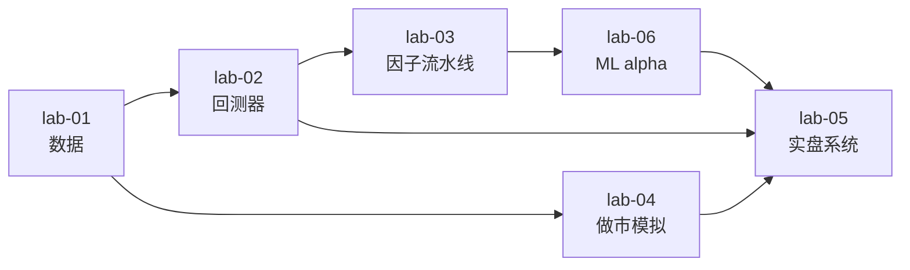

# labs · 动手实验室

> **没有代码的知识点，视为没学。** 这里是全部理论的落地处，也是我未来的作品集。
>
> 六个 lab 是递进的，每一个都建立在前一个之上。不要跳步。

---

## 一、六个 lab

| Lab | 名称 | 对应知识模块 | 出口标准 |
|---|---|---|---|
| [lab-01](./lab-01-data-collector/) | 数据采集与存储 | `03-research-infra/01` | 20+ 标的、2 年+ 干净数据，含资金费/OI，通过全部质量校验 |
| [lab-02](./lab-02-first-backtest/) | 手写事件驱动回测器 | `03-research-infra/02` | 通过 8 项自测；能复现已知策略；含资金费与强平 |
| [lab-03](./lab-03-factor-lab/) | 因子研究流水线 | `03-research-infra/04-05` | 新因子 30 分钟出完整报告；支持 CPCV + DSR |
| [lab-04](./lab-04-market-maker-sim/) | 订单簿与做市模拟 | `02-strategy-zoo/03` | 能量化逆向选择与库存风险；延迟敏感性分析 |
| [lab-05](./lab-05-live-paper-trading/) | 模拟盘/实盘系统 | `05-risk-and-portfolio/04`、`06-engineering` | 连续 30 天无人工干预；三源对账通过 |
| [lab-06](./lab-06-ml-alpha/) | ML alpha 全流程 | `04-ml-and-frontier/01` | 三重障碍标签 + 元标注 + CPCV，衰减可解释 |

---

## 二、依赖关系



**关键路径：lab-01 → lab-02 → lab-03 → lab-05。** lab-04 和 lab-06 可以并行或延后。

---

## 三、统一的项目规范

每个 lab 都按这个结构，方便复用与展示：

```
lab-xx-name/
├── README.md            # 目标 / 结论 / 怎么跑 / 设计取舍
├── pyproject.toml       # 依赖（uv 管理）
├── config/              # 参数配置（yaml），零硬编码
├── src/
│   ├── data/
│   ├── features/
│   ├── strategy/
│   ├── backtest/
│   ├── risk/
│   └── report/
├── notebooks/           # 只用于探索和看图，不放核心逻辑
├── tests/               # 关键逻辑必须有测试
├── results/             # 输出（gitignore，只提交 md 报告）
└── docs/                # 设计文档、踩坑记录
```

### 硬性规则（来自 `00-foundations/04`）

1. Notebook 里不放核心逻辑
2. 参数全部外置到 config
3. 每次 run 记录元数据（config + git hash + 数据版本 + 种子 + 试验次数）
4. 固定随机种子
5. 关键路径必须有测试（成本计算、仓位计算、PnL 累加、信号对齐）
6. 金额用整数最小单位或 Decimal
7. 时间统一 UTC 带时区

---

## 四、README 模板（每个 lab 都要写）

这不只是文档，是**作品集的门面**。见 [`07-career-and-capital/02`](../07-career-and-capital/02-quant-job-market-and-interview.md)。

```markdown
# lab-xx: 名称

## 解决什么问题
（为什么需要这个东西，不解决会怎样）

## 快速开始
（安装 + 运行的最少命令）

## 设计决策与取舍
（为什么这样设计，考虑过什么替代方案，为什么放弃）
← 最能体现水平的一节

## 关键实现细节
（最难的部分是什么，怎么解决的）

## 怎么验证正确性
（测试策略、自测清单、验证结果）
← 立刻区分工程水平的一节

## 结论与发现
（跑出来学到了什么，包括"负面结果"）

## 局限与下一步
（诚实说明做到哪、没做什么）
```

**"负面结果"要写。** "我验证了 X 策略在扣成本后是负期望"是有价值的结论，不是失败。

---

## 五、公开策略

| 内容 | 是否公开 |
|---|---|
| 回测框架、数据管道、因子评估流水线 | ✅ 公开（是工程作品，展示能力） |
| 因子研究方法论、踩坑记录 | ✅ 公开 |
| 具体的有效因子表达式 | ⚠️ 选择性 |
| 实盘参数、资金规模、API 配置 | ❌ 不公开 |
| 密钥 | ❌ **绝不进 git** |

**逻辑**：工程能力公开是资产（建立可信度、帮助求职）；具体 alpha 公开是负债（会被套利掉）。

---

## 六、进度

- [ ] lab-01 数据采集
- [ ] lab-02 回测器
- [ ] lab-03 因子流水线
- [ ] lab-04 做市模拟
- [ ] lab-05 实盘系统
- [ ] lab-06 ML alpha

每完成一个，在 [`journal/progress.md`](../journal/progress.md) 记录，并更新这里的勾选。
